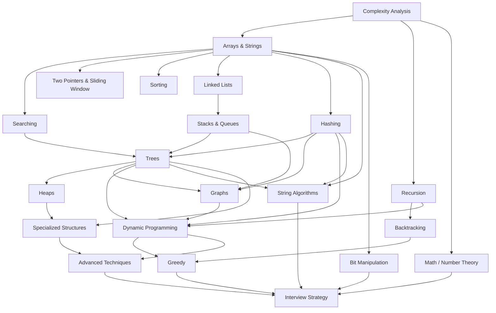

# Algora — Complete DSA Encyclopedia & Daily Video Roadmap

> **Author:** Senior DSA Teaching Lead
> **Created:** August 6, 2026
> **Purpose:** Definitive catalogue of every data structure type, every algorithm concept, and a day-by-day video production schedule from product launch onward.
> **Rule:** Nothing is guessed — every entry is sourced from established CS curriculum, competitive-programming canon, and interview-industry standards.

---

## Part A — Complete Data Structure Catalogue

### Total Count Summary

| Category                       | Sub-categories | Individual Data Structures      |
| :----------------------------- | :------------- | :------------------------------ |
| **1. Primitive**               | 5              | 5                               |
| **2. Arrays & Strings**        | 6              | 6                               |
| **3. Linked Lists**            | 5              | 5                               |
| **4. Stacks**                  | 3              | 3                               |
| **5. Queues**                  | 5              | 5                               |
| **6. Hash-Based**              | 4              | 4                               |
| **7. Trees**                   | 18             | 18                              |
| **8. Heaps**                   | 5              | 5                               |
| **9. Graphs**                  | 7              | 7                               |
| **10. Advanced / Specialized** | 8              | 8                               |
| **TOTAL**                      | **66**         | **66 distinct data structures** |

---

### 1. Primitive Data Structures (5)

| #   | Data Structure          | Description                                   |
| :-- | :---------------------- | :-------------------------------------------- |
| 1   | **Integer**             | Whole numbers (int, long, short, byte)        |
| 2   | **Float / Double**      | Floating-point numbers with decimal precision |
| 3   | **Character**           | Single alphanumeric symbol                    |
| 4   | **Boolean**             | True / False logical value                    |
| 5   | **Pointer / Reference** | Memory address pointing to another variable   |

---

### 2. Arrays & Strings (6)

| #   | Data Structure         | Description                                                |
| :-- | :--------------------- | :--------------------------------------------------------- |
| 1   | **Static Array**       | Fixed-size contiguous block; O(1) random access            |
| 2   | **Dynamic Array**      | Resizable array (ArrayList, Vector); amortized O(1) append |
| 3   | **String**             | Immutable/mutable character sequence                       |
| 4   | **Matrix (2D Array)**  | Grid of values; row × column indexing                      |
| 5   | **Sparse Array**       | Array with mostly default/zero values; stored efficiently  |
| 6   | **Bit Array / Bitset** | Array of bits; compact boolean storage                     |

---

### 3. Linked Lists (5)

| #   | Data Structure                  | Description                              |
| :-- | :------------------------------ | :--------------------------------------- |
| 1   | **Singly Linked List**          | Nodes with one forward pointer           |
| 2   | **Doubly Linked List**          | Nodes with forward + backward pointers   |
| 3   | **Circular Linked List**        | Last node points back to head            |
| 4   | **Circular Doubly Linked List** | Doubly linked + circular                 |
| 5   | **Skip List**                   | Layered linked list with O(log n) search |

---

### 4. Stacks (3)

| #   | Data Structure      | Description                                   |
| :-- | :------------------ | :-------------------------------------------- |
| 1   | **Stack (LIFO)**    | Last-In-First-Out; push/pop from top          |
| 2   | **Monotonic Stack** | Stack maintaining increasing/decreasing order |
| 3   | **Min/Max Stack**   | Stack with O(1) min/max retrieval             |

---

### 5. Queues (5)

| #   | Data Structure                 | Description                                                 |
| :-- | :----------------------------- | :---------------------------------------------------------- |
| 1   | **Queue (FIFO)**               | First-In-First-Out                                          |
| 2   | **Deque (Double-Ended Queue)** | Insert/remove from both ends                                |
| 3   | **Circular Queue**             | Fixed-size queue using wrap-around indexing                 |
| 4   | **Priority Queue**             | Elements dequeued by priority (typically heap-backed)       |
| 5   | **Monotonic Queue / Deque**    | Deque maintaining monotone order for sliding-window queries |

---

### 6. Hash-Based Structures (4)

| #   | Data Structure            | Description                                            |
| :-- | :------------------------ | :----------------------------------------------------- |
| 1   | **Hash Table / Hash Map** | Key → value mapping via hash function                  |
| 2   | **Hash Set**              | Unique-element collection via hashing                  |
| 3   | **Bloom Filter**          | Probabilistic set membership test (no false negatives) |
| 4   | **Count-Min Sketch**      | Probabilistic frequency estimation                     |

---

### 7. Trees (18)

#### 7a. Fundamental Trees (3)

| #   | Data Structure               | Description                           |
| :-- | :--------------------------- | :------------------------------------ |
| 1   | **General Tree**             | Nodes with any number of children     |
| 2   | **Binary Tree**              | Each node has at most 2 children      |
| 3   | **Binary Search Tree (BST)** | Left < root < right ordering property |

#### 7b. Self-Balancing BSTs (4)

| #   | Data Structure     | Description                                   |
| :-- | :----------------- | :-------------------------------------------- |
| 4   | **AVL Tree**       | Height-balanced BST (balance factor ≤ 1)      |
| 5   | **Red-Black Tree** | Color-balanced BST (used in most stdlib maps) |
| 6   | **Splay Tree**     | Self-adjusting BST (recently accessed → root) |
| 7   | **Treap**          | Tree + Heap hybrid using random priorities    |

#### 7c. Multi-Way Trees (3)

| #   | Data Structure            | Description                                        |
| :-- | :------------------------ | :------------------------------------------------- |
| 8   | **B-Tree**                | Self-balancing multi-way tree for disk storage     |
| 9   | **B+ Tree**               | B-Tree with data only in leaves; linked leaf chain |
| 10  | **2-3 Tree / 2-3-4 Tree** | Multi-way search trees (equivalent to red-black)   |

#### 7d. Specialized Trees (8)

| #   | Data Structure         | Description                                       |
| :-- | :--------------------- | :------------------------------------------------ |
| 11  | **Trie (Prefix Tree)** | Character-by-character string storage             |
| 12  | **Suffix Tree**        | Compressed trie of all suffixes of a string       |
| 13  | **Segment Tree**       | Range query/update on arrays in O(log n)          |
| 14  | **Fenwick Tree (BIT)** | Prefix sums with point updates in O(log n)        |
| 15  | **Interval Tree**      | Stores intervals; query for overlapping intervals |
| 16  | **K-D Tree**           | Multi-dimensional space partitioning              |
| 17  | **Merkle Tree**        | Hash tree for data integrity verification         |
| 18  | **N-ary Tree**         | Tree where each node can have up to N children    |

---

### 8. Heaps (5)

| #   | Data Structure            | Description                                     |
| :-- | :------------------------ | :---------------------------------------------- |
| 1   | **Binary Heap (Min/Max)** | Complete binary tree with heap property         |
| 2   | **Fibonacci Heap**        | Amortized O(1) decrease-key; used in Dijkstra's |
| 3   | **Binomial Heap**         | Collection of binomial trees                    |
| 4   | **Pairing Heap**          | Simplified Fibonacci heap                       |
| 5   | **D-ary Heap**            | Generalized heap with d children per node       |

---

### 9. Graph Representations (7)

| #   | Data Structure                  | Description                                    |
| :-- | :------------------------------ | :--------------------------------------------- |
| 1   | **Adjacency List**              | Array of lists storing neighbors per vertex    |
| 2   | **Adjacency Matrix**            | V × V matrix storing edge weights              |
| 3   | **Edge List**                   | Simple list of (u, v, weight) tuples           |
| 4   | **Incidence Matrix**            | Vertices × edges matrix                        |
| 5   | **Adjacency Map**               | HashMap-based adjacency for sparse graphs      |
| 6   | **Compressed Sparse Row (CSR)** | Cache-friendly flat array graph representation |
| 7   | **Implicit Graph**              | Graph defined by rules, not stored explicitly  |

---

### 10. Advanced / Specialized Structures (8)

| #   | Data Structure                 | Description                                                           |
| :-- | :----------------------------- | :-------------------------------------------------------------------- |
| 1   | **Disjoint Set / Union-Find**  | Track connected components with near-O(1) operations                  |
| 2   | **LRU Cache**                  | Least-Recently-Used eviction (HashMap + Doubly Linked List)           |
| 3   | **Ordered Set / Multiset**     | BST-backed sorted collection                                          |
| 4   | **Deque (Array-based)**        | Ring-buffer double-ended queue                                        |
| 5   | **Rope**                       | Balanced binary tree for efficient string concatenation               |
| 6   | **Suffix Array**               | Sorted array of all suffix start indices                              |
| 7   | **Sparse Table**               | O(1) range minimum query after O(n log n) build                       |
| 8   | **Persistent Data Structures** | Immutable versions preserving history (persistent segment tree, etc.) |

---

## Part B — Complete Algorithm Concepts Catalogue

### Total Count Summary

| Category                             | Individual Algorithms / Concepts |
| :----------------------------------- | :------------------------------- |
| **1. Complexity Analysis**           | 8                                |
| **2. Recursion & Backtracking**      | 7                                |
| **3. Sorting Algorithms**            | 12                               |
| **4. Searching Algorithms**          | 7                                |
| **5. Two Pointers & Sliding Window** | 6                                |
| **6. Linked List Algorithms**        | 7                                |
| **7. Stack & Queue Algorithms**      | 6                                |
| **8. Hashing Techniques**            | 6                                |
| **9. Tree Algorithms**               | 12                               |
| **10. Heap Algorithms**              | 5                                |
| **11. Graph Algorithms**             | 22                               |
| **12. Dynamic Programming**          | 14                               |
| **13. Greedy Algorithms**            | 8                                |
| **14. Divide and Conquer**           | 5                                |
| **15. String Algorithms**            | 12                               |
| **16. Bit Manipulation**             | 6                                |
| **17. Mathematical / Number Theory** | 10                               |
| **18. Advanced Techniques**          | 8                                |
| **TOTAL**                            | **161 algorithm concepts**       |

---

### 1. Complexity Analysis (8 concepts)

| #   | Concept                                   | Description                              |
| :-- | :---------------------------------------- | :--------------------------------------- |
| 1   | **Big-O Notation**                        | Upper bound growth rate                  |
| 2   | **Big-Ω (Omega) Notation**                | Lower bound growth rate                  |
| 3   | **Big-Θ (Theta) Notation**                | Tight bound growth rate                  |
| 4   | **Time Complexity Analysis**              | Counting operations as function of input |
| 5   | **Space Complexity Analysis**             | Memory usage as function of input        |
| 6   | **Amortized Analysis**                    | Average cost over sequence of operations |
| 7   | **Best / Worst / Average Case**           | Analyzing different input scenarios      |
| 8   | **Recurrence Relations (Master Theorem)** | Solving T(n) = aT(n/b) + f(n)            |

---

### 2. Recursion & Backtracking (7 concepts)

| #   | Concept                                    | Description                                    |
| :-- | :----------------------------------------- | :--------------------------------------------- |
| 1   | **Simple Recursion**                       | Function calling itself with base case         |
| 2   | **Tail Recursion**                         | Recursive call is last operation (optimizable) |
| 3   | **Multiple Recursion**                     | Function calls itself multiple times per call  |
| 4   | **Backtracking**                           | Explore → validate → undo pattern              |
| 5   | **N-Queens Problem**                       | Classic backtracking: place N queens safely    |
| 6   | **Sudoku Solver**                          | Constraint-satisfaction backtracking           |
| 7   | **Permutations & Combinations Generation** | Recursive enumeration of arrangements          |

---

### 3. Sorting Algorithms (12 concepts)

| #   | Algorithm          | Time (Best / Avg / Worst)            | Stable | In-Place |
| :-- | :----------------- | :----------------------------------- | :----- | :------- |
| 1   | **Bubble Sort**    | O(n) / O(n²) / O(n²)                 | ✅     | ✅       |
| 2   | **Selection Sort** | O(n²) / O(n²) / O(n²)                | ❌     | ✅       |
| 3   | **Insertion Sort** | O(n) / O(n²) / O(n²)                 | ✅     | ✅       |
| 4   | **Merge Sort**     | O(n log n) / O(n log n) / O(n log n) | ✅     | ❌       |
| 5   | **Quick Sort**     | O(n log n) / O(n log n) / O(n²)      | ❌     | ✅       |
| 6   | **Heap Sort**      | O(n log n) / O(n log n) / O(n log n) | ❌     | ✅       |
| 7   | **Counting Sort**  | O(n + k) / O(n + k) / O(n + k)       | ✅     | ❌       |
| 8   | **Radix Sort**     | O(nk) / O(nk) / O(nk)                | ✅     | ❌       |
| 9   | **Bucket Sort**    | O(n + k) / O(n + k) / O(n²)          | ✅     | ❌       |
| 10  | **Shell Sort**     | O(n log n) / depends / O(n²)         | ❌     | ✅       |
| 11  | **Tim Sort**       | O(n) / O(n log n) / O(n log n)       | ✅     | ❌       |
| 12  | **Cycle Sort**     | O(n²) / O(n²) / O(n²)                | ❌     | ✅       |

---

### 4. Searching Algorithms (7 concepts)

| #   | Algorithm                   | Description                                                 |
| :-- | :-------------------------- | :---------------------------------------------------------- |
| 1   | **Linear Search**           | Sequential scan; O(n)                                       |
| 2   | **Binary Search**           | Sorted array half-division; O(log n)                        |
| 3   | **Binary Search on Answer** | Monotone predicate search over value space                  |
| 4   | **Ternary Search**          | Unimodal function optimization; O(log n)                    |
| 5   | **Interpolation Search**    | Estimate position in uniform distribution; O(log log n) avg |
| 6   | **Exponential Search**      | Find range then binary search; O(log n)                     |
| 7   | **Jump Search**             | Block-based search; O(√n)                                   |

---

### 5. Two Pointers & Sliding Window (6 concepts)

| #   | Technique                             | Description                                       |
| :-- | :------------------------------------ | :------------------------------------------------ |
| 1   | **Two Pointers (Same Direction)**     | Both pointers move forward (fast/slow)            |
| 2   | **Two Pointers (Opposite Direction)** | Pointers converge from both ends                  |
| 3   | **Fast & Slow Pointers (Floyd's)**    | Cycle detection in linked lists                   |
| 4   | **Fixed-Size Sliding Window**         | Window of constant width slides across array      |
| 5   | **Variable-Size Sliding Window**      | Expand/shrink to maintain a constraint            |
| 6   | **Prefix Sums**                       | Precompute cumulative sums for O(1) range queries |

---

### 6. Linked List Algorithms (7 concepts)

| #   | Algorithm                  | Description                                 |
| :-- | :------------------------- | :------------------------------------------ |
| 1   | **Traversal & Search**     | Walk nodes to find or process               |
| 2   | **Reversal**               | Reverse pointers iteratively or recursively |
| 3   | **Merge Two Sorted Lists** | Zip two sorted lists into one               |
| 4   | **Detect Cycle (Floyd's)** | Tortoise and hare algorithm                 |
| 5   | **Find Middle Node**       | Slow/fast pointer to locate midpoint        |
| 6   | **Remove Nth from End**    | Two-pointer with gap                        |
| 7   | **Flatten Nested List**    | Convert multi-level list to single level    |

---

### 7. Stack & Queue Algorithms (6 concepts)

| #   | Algorithm                             | Description                           |
| :-- | :------------------------------------ | :------------------------------------ |
| 1   | **Balanced Parentheses**              | Check matching brackets using stack   |
| 2   | **Next Greater / Smaller Element**    | Monotonic stack pattern               |
| 3   | **Evaluate Postfix / Prefix**         | Expression evaluation using stack     |
| 4   | **Infix to Postfix (Shunting Yard)**  | Convert expression notation           |
| 5   | **Sliding Window Maximum**            | Monotonic deque for range max in O(n) |
| 6   | **Stack-based DFS / Queue-based BFS** | Iterative traversal patterns          |

---

### 8. Hashing Techniques (6 concepts)

| #   | Technique                                  | Description                              |
| :-- | :----------------------------------------- | :--------------------------------------- |
| 1   | **Hash Function Design**                   | Mapping keys to indices                  |
| 2   | **Collision Resolution — Chaining**        | Linked lists at each bucket              |
| 3   | **Collision Resolution — Open Addressing** | Linear/quadratic probing, double hashing |
| 4   | **Load Factor & Rehashing**                | When and how to resize                   |
| 5   | **Frequency Counting**                     | Count occurrences using hash map         |
| 6   | **Rolling Hash (Rabin Fingerprint)**       | O(1) hash update for sliding window      |

---

### 9. Tree Algorithms (12 concepts)

| #   | Algorithm                          | Description                                |
| :-- | :--------------------------------- | :----------------------------------------- |
| 1   | **Inorder Traversal**              | Left → Root → Right                        |
| 2   | **Preorder Traversal**             | Root → Left → Right                        |
| 3   | **Postorder Traversal**            | Left → Right → Root                        |
| 4   | **Level-Order Traversal (BFS)**    | Visit nodes by depth level                 |
| 5   | **BST Insert / Delete / Search**   | Maintain BST property during mutations     |
| 6   | **Lowest Common Ancestor (LCA)**   | Find deepest shared ancestor               |
| 7   | **Tree Diameter**                  | Longest path between any two nodes         |
| 8   | **Check if BST is Valid**          | Verify ordering with min/max bounds        |
| 9   | **Serialize / Deserialize Tree**   | Convert tree to string and back            |
| 10  | **Morris Traversal**               | O(1) space inorder using threaded pointers |
| 11  | **AVL Rotations (LL, RR, LR, RL)** | Self-balancing insertion/deletion          |
| 12  | **Trie Insert / Search / Delete**  | Prefix-based string operations             |

---

### 10. Heap Algorithms (5 concepts)

| #   | Algorithm                         | Description                                |
| :-- | :-------------------------------- | :----------------------------------------- |
| 1   | **Heapify (Sift Up / Sift Down)** | Maintain heap property                     |
| 2   | **Build Heap**                    | Convert array to heap in O(n)              |
| 3   | **Heap Sort**                     | Sort using max-heap extraction             |
| 4   | **Top-K Elements**                | Use min-heap of size K for streaming top-K |
| 5   | **Merge K Sorted Lists**          | Priority queue to merge multiple streams   |

---

### 11. Graph Algorithms (22 concepts)

#### 11a. Traversal (4)

| #   | Algorithm                      | Description                        |
| :-- | :----------------------------- | :--------------------------------- |
| 1   | **Breadth-First Search (BFS)** | Level-by-level exploration         |
| 2   | **Depth-First Search (DFS)**   | Deep exploration with backtracking |
| 3   | **Iterative Deepening DFS**    | DFS with increasing depth limits   |
| 4   | **Bidirectional BFS**          | Search from both source and target |

#### 11b. Shortest Path (5)

| #   | Algorithm                                 | Description                                         |
| :-- | :---------------------------------------- | :-------------------------------------------------- |
| 5   | **Dijkstra's Algorithm**                  | Single-source, non-negative weights; O((V+E) log V) |
| 6   | **Bellman-Ford Algorithm**                | Single-source, handles negative weights; O(VE)      |
| 7   | **Floyd-Warshall Algorithm**              | All-pairs shortest paths; O(V³)                     |
| 8   | **A\* Search**                            | Heuristic-guided shortest path                      |
| 9   | **SPFA (Shortest Path Faster Algorithm)** | Queue-optimized Bellman-Ford                        |

#### 11c. Minimum Spanning Tree (3)

| #   | Algorithm               | Description                                      |
| :-- | :---------------------- | :----------------------------------------------- |
| 10  | **Kruskal's Algorithm** | Sort edges + Union-Find                          |
| 11  | **Prim's Algorithm**    | Grow MST from single vertex using priority queue |
| 12  | **Borůvka's Algorithm** | Parallel MST construction                        |

#### 11d. Connectivity & Components (4)

| #   | Algorithm                             | Description                        |
| :-- | :------------------------------------ | :--------------------------------- |
| 13  | **Connected Components (Undirected)** | BFS/DFS to find components         |
| 14  | **Tarjan's Algorithm (SCC)**          | Find strongly connected components |
| 15  | **Kosaraju's Algorithm (SCC)**        | Two-pass DFS for SCCs              |
| 16  | **Articulation Points & Bridges**     | Find cut vertices and bridge edges |

#### 11e. Ordering & Flow (6)

| #   | Algorithm                                    | Description                              |
| :-- | :------------------------------------------- | :--------------------------------------- |
| 17  | **Topological Sort (Kahn's / DFS)**          | Linear ordering of DAG vertices          |
| 18  | **Cycle Detection (Directed / Undirected)**  | Detect loops in graphs                   |
| 19  | **Bipartite Check (2-Coloring)**             | Verify graph is 2-colorable              |
| 20  | **Ford-Fulkerson / Edmonds-Karp (Max Flow)** | Maximum network flow                     |
| 21  | **Union-Find / Disjoint Set Union**          | Near-O(1) component merging              |
| 22  | **Euler Path / Hamiltonian Path**            | Traverse all edges/vertices exactly once |

---

### 12. Dynamic Programming (14 concepts)

| #   | Pattern                                         | Classic Problems                                  |
| :-- | :---------------------------------------------- | :------------------------------------------------ |
| 1   | **Linear DP (1D)**                              | Fibonacci, Climbing Stairs, House Robber          |
| 2   | **0/1 Knapsack**                                | Subset Sum, Partition Equal Subset                |
| 3   | **Unbounded Knapsack**                          | Coin Change, Rod Cutting                          |
| 4   | **Longest Common Subsequence (LCS)**            | LCS, Edit Distance, Shortest Common Supersequence |
| 5   | **Longest Increasing Subsequence (LIS)**        | LIS, Russian Doll Envelopes                       |
| 6   | **Longest Palindromic Subsequence / Substring** | Manacher's, DP palindrome check                   |
| 7   | **Grid DP**                                     | Unique Paths, Minimum Path Sum, Dungeon Game      |
| 8   | **Interval DP**                                 | Matrix Chain Multiplication, Burst Balloons       |
| 9   | **State Machine DP**                            | Stock Buy/Sell variants                           |
| 10  | **Bitmask DP**                                  | Traveling Salesman, Assignment Problem            |
| 11  | **Tree DP**                                     | Diameter, max path sum, re-rooting                |
| 12  | **Digit DP**                                    | Count numbers with digit constraints              |
| 13  | **Memoization (Top-Down)**                      | Recursive + cache approach                        |
| 14  | **Tabulation (Bottom-Up)**                      | Iterative table-filling approach                  |

---

### 13. Greedy Algorithms (8 concepts)

| #   | Algorithm                         | Description                                 |
| :-- | :-------------------------------- | :------------------------------------------ |
| 1   | **Activity Selection**            | Max non-overlapping intervals               |
| 2   | **Fractional Knapsack**           | Greedy item selection by value/weight ratio |
| 3   | **Huffman Coding**                | Optimal prefix-free compression             |
| 4   | **Job Sequencing with Deadlines** | Maximize profit with deadlines              |
| 5   | **Interval Scheduling / Merging** | Merge overlapping intervals; schedule rooms |
| 6   | **Jump Game**                     | Can you reach the end? Minimum jumps?       |
| 7   | **Gas Station Problem**           | Circular route feasibility                  |
| 8   | **Greedy vs. DP Comparison**      | When greedy works and when it fails         |

---

### 14. Divide and Conquer (5 concepts)

| #   | Algorithm                            | Description                  |
| :-- | :----------------------------------- | :--------------------------- |
| 1   | **Merge Sort**                       | Divide → sort halves → merge |
| 2   | **Quick Sort / Quick Select**        | Partition around pivot       |
| 3   | **Binary Search**                    | Divide search space in half  |
| 4   | **Closest Pair of Points**           | Geometric divide and conquer |
| 5   | **Strassen's Matrix Multiplication** | O(n^2.81) matrix multiply    |

---

### 15. String Algorithms (12 concepts)

| #   | Algorithm                                 | Description                                       |
| :-- | :---------------------------------------- | :------------------------------------------------ |
| 1   | **Naive Pattern Matching**                | Check every position; O(n×m)                      |
| 2   | **KMP (Knuth-Morris-Pratt)**              | LPS array; O(n+m) single pattern match            |
| 3   | **Rabin-Karp**                            | Rolling hash; O(n+m) average                      |
| 4   | **Z-Algorithm**                           | Z-array for pattern matching; O(n+m)              |
| 5   | **Boyer-Moore**                           | Right-to-left with bad-char/good-suffix rules     |
| 6   | **Aho-Corasick**                          | Multi-pattern matching using trie + failure links |
| 7   | **Suffix Array Construction**             | Sorted suffix indices; O(n log n)                 |
| 8   | **Suffix Tree**                           | Compressed trie of all suffixes                   |
| 9   | **Manacher's Algorithm**                  | Longest palindromic substring in O(n)             |
| 10  | **String Hashing**                        | Polynomial rolling hash for O(1) comparison       |
| 11  | **Longest Common Prefix (LCP Array)**     | Used with suffix arrays                           |
| 12  | **Trie-based Autocomplete / Word Search** | Prefix search and dictionary operations           |

---

### 16. Bit Manipulation (6 concepts)

| #   | Technique                                         | Description                           |
| :-- | :------------------------------------------------ | :------------------------------------ |
| 1   | **Bitwise Operators (AND, OR, XOR, NOT, Shifts)** | Fundamental bit operations            |
| 2   | **Check / Set / Clear / Toggle Bit**              | Manipulate individual bits            |
| 3   | **Count Set Bits (Hamming Weight)**               | Brian Kernighan's algorithm           |
| 4   | **Power of Two Check**                            | n & (n-1) == 0                        |
| 5   | **XOR Tricks**                                    | Find single number, swap without temp |
| 6   | **Bitmask Subsets**                               | Enumerate all subsets of a set        |

---

### 17. Mathematical / Number Theory (10 concepts)

| #   | Concept                             | Description                          |
| :-- | :---------------------------------- | :----------------------------------- |
| 1   | **GCD / LCM (Euclidean Algorithm)** | Greatest common divisor              |
| 2   | **Sieve of Eratosthenes**           | Find all primes up to N              |
| 3   | **Modular Arithmetic**              | Operations under modulo              |
| 4   | **Fast Exponentiation (Binary)**    | Compute a^b mod m in O(log b)        |
| 5   | **Combinatorics (nCr, nPr)**        | Permutations and combinations        |
| 6   | **Matrix Exponentiation**           | Solve linear recurrences in O(log n) |
| 7   | **Probability Basics**              | Expected value, random sampling      |
| 8   | **Catalan Numbers**                 | Count valid parentheses, BSTs, paths |
| 9   | **Prime Factorization**             | Decompose into prime factors         |
| 10  | **Chinese Remainder Theorem**       | Solve system of modular equations    |

---

### 18. Advanced Techniques (8 concepts)

| #   | Technique                                | Description                             |
| :-- | :--------------------------------------- | :-------------------------------------- |
| 1   | **Segment Tree with Lazy Propagation**   | Range update + range query in O(log n)  |
| 2   | **Heavy-Light Decomposition**            | Path queries on trees in O(log² n)      |
| 3   | **Centroid Decomposition**               | Tree decomposition for distance queries |
| 4   | **Mo's Algorithm**                       | Offline range queries in O((N+Q)√N)     |
| 5   | **Square Root Decomposition**            | Block decomposition for range queries   |
| 6   | **Coordinate Compression**               | Map large value ranges to small indices |
| 7   | **Line Sweep**                           | Process events along a sweep line       |
| 8   | **Convex Hull (Graham Scan / Andrew's)** | Compute convex hull of point set        |

---

## Part C — Grand Totals

| What                           | Count   |
| :----------------------------- | :------ |
| **Total Data Structure Types** | **66**  |
| **Total Algorithm Concepts**   | **161** |
| **Combined DSA Topics**        | **227** |

---

## Part D — Daily Video Production Roadmap

> **Format:** Each day = one focused video (15–25 min) + visualization on Algora platform.
> **Approach:** Concept → Visual model → Code binding → Practice problem.
> **Release cadence:** One video per day, every day. Weekends = recap/challenge videos.

---

### MONTH 1 — Foundations & Arrays (Days 1–30)

#### Week 1: Foundations (Days 1–7)

| Day | Topic                                 | Type    | Video Title                                         |
| :-- | :------------------------------------ | :------ | :-------------------------------------------------- |
| 1   | What is DSA? Why it matters           | Intro   | "Why DSA Will Make or Break Your Career"            |
| 2   | Big-O Notation                        | Concept | "Big-O Explained: Stop Guessing Time Complexity"    |
| 3   | Big-Ω, Big-Θ, Best/Worst/Average      | Concept | "The Full Picture: Omega, Theta & When They Matter" |
| 4   | Space Complexity                      | Concept | "Memory Matters: Space Complexity Demystified"      |
| 5   | Recursion Basics                      | Concept | "Recursion: The Pattern That Powers Everything"     |
| 6   | Recurrence Relations & Master Theorem | Concept | "Solve Any Recurrence: The Master Theorem"          |
| 7   | **Week 1 Recap & Challenge**          | Recap   | "Week 1 Challenge: Can You Analyze This Code?"      |

#### Week 2: Arrays Deep Dive (Days 8–14)

| Day | Topic                               | Type  | Video Title                                   |
| :-- | :---------------------------------- | :---- | :-------------------------------------------- |
| 8   | Static Arrays                       | DS    | "Arrays: The Foundation of Everything"        |
| 9   | Dynamic Arrays (ArrayList/Vector)   | DS    | "How Dynamic Arrays Actually Grow"            |
| 10  | Linear Search                       | Algo  | "Linear Search: The Simplest Algorithm"       |
| 11  | Binary Search                       | Algo  | "Binary Search: Cut Your Problem in Half"     |
| 12  | Binary Search Variations (Boundary) | Algo  | "Binary Search Mastery: Lower/Upper Bound"    |
| 13  | Binary Search on Answer             | Algo  | "Binary Search on Answer: The Hidden Pattern" |
| 14  | **Week 2 Recap & Challenge**        | Recap | "Week 2 Challenge: Search Like a Pro"         |

#### Week 3: Array Patterns (Days 15–21)

| Day | Topic                             | Type    | Video Title                                      |
| :-- | :-------------------------------- | :------ | :----------------------------------------------- |
| 15  | Two Pointers (Opposite Direction) | Pattern | "Two Pointers: Converge from Both Ends"          |
| 16  | Two Pointers (Same Direction)     | Pattern | "Two Pointers: The Fast & Slow Dance"            |
| 17  | Prefix Sums                       | Pattern | "Prefix Sums: O(1) Range Queries Forever"        |
| 18  | Fixed-Size Sliding Window         | Pattern | "Sliding Window: The Fixed-Size Secret"          |
| 19  | Variable-Size Sliding Window      | Pattern | "Sliding Window: Expand & Shrink Like a Pro"     |
| 20  | Kadane's Algorithm (Max Subarray) | Algo    | "Kadane's Algorithm: The Beautiful Greedy Trick" |
| 21  | **Week 3 Recap & Challenge**      | Recap   | "Week 3 Challenge: Array Patterns Battle"        |

#### Week 4: Strings & Matrix (Days 22–28)

| Day | Topic                        | Type  | Video Title                                   |
| :-- | :--------------------------- | :---- | :-------------------------------------------- |
| 22  | Strings as Arrays            | DS    | "Strings: Character Arrays with Superpowers"  |
| 23  | String Manipulation Patterns | Algo  | "Reverse, Rotate, Compress: String Tricks"    |
| 24  | Anagram & Palindrome Checks  | Algo  | "Is It an Anagram? Is It a Palindrome?"       |
| 25  | Matrix (2D Array) Basics     | DS    | "2D Arrays: Navigate the Grid"                |
| 26  | Matrix Traversal Patterns    | Algo  | "Spiral, Diagonal, Snake: Matrix Walks"       |
| 27  | Bit Array / Bitset           | DS    | "Bitset: The Most Space-Efficient Array"      |
| 28  | **Week 4 Recap & Challenge** | Recap | "Week 4 Challenge: Strings & Matrix Showdown" |

#### Days 29–30: Month 1 Wrap

| Day | Topic                              | Type  | Video Title                                  |
| :-- | :--------------------------------- | :---- | :------------------------------------------- |
| 29  | Sorting Introduction + Bubble Sort | Algo  | "Bubble Sort: Simple, Slow, But Instructive" |
| 30  | **Month 1 Grand Recap**            | Recap | "Month 1 Complete: Your Foundation Is Set"   |

---

### MONTH 2 — Sorting, Linked Lists & Stacks/Queues (Days 31–60)

#### Week 5: Sorting Algorithms I (Days 31–37)

| Day | Topic                            | Type  | Video Title                                   |
| :-- | :------------------------------- | :---- | :-------------------------------------------- |
| 31  | Selection Sort                   | Algo  | "Selection Sort: Find the Minimum, Place It"  |
| 32  | Insertion Sort                   | Algo  | "Insertion Sort: The Card-Player's Algorithm" |
| 33  | Merge Sort                       | Algo  | "Merge Sort: Divide, Conquer, Merge"          |
| 34  | Quick Sort                       | Algo  | "Quick Sort: The Partition Magic"             |
| 35  | Quick Select (Kth Element)       | Algo  | "Quick Select: Find Kth Without Full Sort"    |
| 36  | Heap Sort                        | Algo  | "Heap Sort: Priority Queue Meets Sorting"     |
| 37  | **Week 5 Recap: Sorting Battle** | Recap | "Sorting Showdown: Which One Wins?"           |

#### Week 6: Sorting Algorithms II & Stability (Days 38–44)

| Day | Topic                               | Type    | Video Title                                 |
| :-- | :---------------------------------- | :------ | :------------------------------------------ |
| 38  | Counting Sort                       | Algo    | "Counting Sort: When Numbers Are Small"     |
| 39  | Radix Sort                          | Algo    | "Radix Sort: Sort Digit by Digit"           |
| 40  | Bucket Sort                         | Algo    | "Bucket Sort: Distribute and Conquer"       |
| 41  | Shell Sort & Tim Sort               | Algo    | "Shell Sort & Tim Sort: Real-World Hybrids" |
| 42  | Sorting Stability & Comparators     | Concept | "Stable vs Unstable: Why It Matters"        |
| 43  | Cycle Sort & Comparison Lower Bound | Algo    | "Can We Sort Faster Than O(n log n)?"       |
| 44  | **Week 6 Recap & Challenge**        | Recap   | "Week 6 Challenge: Sort Any Array"          |

#### Week 7: Linked Lists (Days 45–51)

| Day | Topic                                | Type  | Video Title                                  |
| :-- | :----------------------------------- | :---- | :------------------------------------------- |
| 45  | Singly Linked List                   | DS    | "Linked Lists: Nodes, Pointers, Freedom"     |
| 46  | Doubly Linked List                   | DS    | "Doubly Linked: Navigate Both Ways"          |
| 47  | Circular Linked List                 | DS    | "Circular Lists: The Loop That Works"        |
| 48  | Linked List Reversal                 | Algo  | "Reverse a Linked List: The Must-Know Trick" |
| 49  | Fast & Slow Pointers (Floyd's Cycle) | Algo  | "Floyd's Tortoise & Hare: Detect the Cycle"  |
| 50  | Merge Two Sorted Lists               | Algo  | "Merge Sorted Lists: The Interview Classic"  |
| 51  | **Week 7 Recap & Challenge**         | Recap | "Week 7 Challenge: Master the Pointers"      |

#### Week 8: Stacks & Queues (Days 52–58)

| Day | Topic                         | Type    | Video Title                                    |
| :-- | :---------------------------- | :------ | :--------------------------------------------- |
| 52  | Stack (LIFO)                  | DS      | "Stack: Last In, First Out — See It Think"     |
| 53  | Balanced Parentheses          | Algo    | "Matching Brackets: The Stack's First Job"     |
| 54  | Monotonic Stack               | DS+Algo | "Monotonic Stack: Next Greater Element"        |
| 55  | Min/Max Stack                 | DS      | "Min Stack: O(1) Minimum at All Times"         |
| 56  | Queue (FIFO) & Circular Queue | DS      | "Queue: First In, First Out — Fair Scheduling" |
| 57  | Deque & Monotonic Deque       | DS+Algo | "Deque: Sliding Window Maximum in O(n)"        |
| 58  | **Week 8 Recap & Challenge**  | Recap   | "Week 8 Challenge: Stack vs Queue Battle"      |

#### Days 59–60: Month 2 Wrap

| Day | Topic                   | Type  | Video Title                                          |
| :-- | :---------------------- | :---- | :--------------------------------------------------- |
| 59  | Skip List               | DS    | "Skip List: The Linked List That Searches Fast"      |
| 60  | **Month 2 Grand Recap** | Recap | "Month 2 Complete: You Think in Data Structures Now" |

---

### MONTH 3 — Hashing, Trees & Heaps (Days 61–90)

#### Week 9: Hash Tables (Days 61–67)

| Day | Topic                                  | Type    | Video Title                                     |
| :-- | :------------------------------------- | :------ | :---------------------------------------------- |
| 61  | Hash Function Design                   | Concept | "Hash Functions: The Key to O(1) Lookup"        |
| 62  | Hash Table / Hash Map                  | DS      | "Hash Map: The Most Used Data Structure"        |
| 63  | Hash Set                               | DS      | "Hash Set: Unique Elements, Instant Lookup"     |
| 64  | Collision Resolution (Chaining)        | Concept | "Collisions Part 1: Chaining with Linked Lists" |
| 65  | Collision Resolution (Open Addressing) | Concept | "Collisions Part 2: Probing Strategies"         |
| 66  | Frequency Counting + Grouping          | Pattern | "Counting Frequencies: The Interview Workhorse" |
| 67  | **Week 9 Recap & Challenge**           | Recap   | "Week 9 Challenge: Hash Everything"             |

#### Week 10: Trees I — Fundamentals (Days 68–74)

| Day | Topic                                  | Type  | Video Title                                    |
| :-- | :------------------------------------- | :---- | :--------------------------------------------- |
| 68  | Tree Vocabulary & Binary Trees         | DS    | "Trees: Roots, Leaves, and Everything Between" |
| 69  | Inorder, Preorder, Postorder Traversal | Algo  | "Tree Traversals: Three Ways to Walk a Tree"   |
| 70  | Level-Order Traversal (BFS on Trees)   | Algo  | "Level Order: BFS Meets Trees"                 |
| 71  | Binary Search Tree (BST)               | DS    | "BST: The Sorted Tree"                         |
| 72  | BST Insert / Delete / Search           | Algo  | "BST Operations: Keep It Ordered"              |
| 73  | Validate BST + Lowest Common Ancestor  | Algo  | "Is This a Valid BST? Find the LCA"            |
| 74  | **Week 10 Recap & Challenge**          | Recap | "Week 10 Challenge: Tree Traversal Mastery"    |

#### Week 11: Trees II — Advanced (Days 75–81)

| Day | Topic                               | Type  | Video Title                                 |
| :-- | :---------------------------------- | :---- | :------------------------------------------ |
| 75  | Tree Diameter & Max Path Sum        | Algo  | "Tree Diameter: The Longest Walk"           |
| 76  | Serialize / Deserialize Binary Tree | Algo  | "Save & Load a Tree: Serialization"         |
| 77  | AVL Tree & Rotations                | DS    | "AVL Tree: Self-Balancing in Action"        |
| 78  | Red-Black Tree (Concept)            | DS    | "Red-Black Trees: How Java's TreeMap Works" |
| 79  | N-ary Tree & General Trees          | DS    | "Beyond Binary: N-ary Trees"                |
| 80  | Morris Traversal (O(1) Space)       | Algo  | "Morris Traversal: No Stack, No Recursion"  |
| 81  | **Week 11 Recap & Challenge**       | Recap | "Week 11 Challenge: Advanced Tree Problems" |

#### Week 12: Heaps & Priority Queues (Days 82–88)

| Day | Topic                                   | Type    | Video Title                                    |
| :-- | :-------------------------------------- | :------ | :--------------------------------------------- |
| 82  | Binary Heap (Min & Max)                 | DS      | "Binary Heap: The Priority Machine"            |
| 83  | Heapify & Build Heap                    | Algo    | "Build Heap in O(n): The Surprising Proof"     |
| 84  | Priority Queue                          | DS      | "Priority Queue: Always Serve the Most Urgent" |
| 85  | Top-K Elements Pattern                  | Pattern | "Top-K: Stream Processing with Heaps"          |
| 86  | Merge K Sorted Lists                    | Algo    | "Merge K Lists: The Heap-Powered Solution"     |
| 87  | Fibonacci Heap, Binomial Heap (Concept) | DS      | "Advanced Heaps: Fibonacci & Binomial"         |
| 88  | **Week 12 Recap & Challenge**           | Recap   | "Week 12 Challenge: Heap Mastery"              |

#### Days 89–90: Month 3 Wrap

| Day | Topic                   | Type  | Video Title                                      |
| :-- | :---------------------- | :---- | :----------------------------------------------- |
| 89  | Trie (Prefix Tree)      | DS    | "Trie: Store Every Word, Search Every Prefix"    |
| 90  | **Month 3 Grand Recap** | Recap | "Month 3 Complete: Trees, Heaps, Hashing — Done" |

---

### MONTH 4 — Graphs (Days 91–120)

#### Week 13: Graph Fundamentals (Days 91–97)

| Day | Topic                              | Type  | Video Title                                 |
| :-- | :--------------------------------- | :---- | :------------------------------------------ |
| 91  | Graph Vocabulary & Representations | DS    | "Graphs: Vertices, Edges, and Connections"  |
| 92  | Adjacency List vs Matrix           | DS    | "Adjacency List vs Matrix: Which to Use?"   |
| 93  | BFS on Graphs                      | Algo  | "Graph BFS: Explore Level by Level"         |
| 94  | DFS on Graphs                      | Algo  | "Graph DFS: Go Deep, Then Backtrack"        |
| 95  | Connected Components               | Algo  | "Connected Components: How Many Islands?"   |
| 96  | Cycle Detection (Undirected)       | Algo  | "Detecting Cycles in Undirected Graphs"     |
| 97  | **Week 13 Recap & Challenge**      | Recap | "Week 13 Challenge: Graph Traversal Expert" |

#### Week 14: Shortest Paths (Days 98–104)

| Day | Topic                          | Type    | Video Title                                       |
| :-- | :----------------------------- | :------ | :------------------------------------------------ |
| 98  | BFS Shortest Path (Unweighted) | Algo    | "BFS for Shortest Path: Unweighted Graphs"        |
| 99  | Dijkstra's Algorithm           | Algo    | "Dijkstra's: Find the Shortest Path"              |
| 100 | Bellman-Ford Algorithm         | Algo    | "Bellman-Ford: Handle Negative Weights"           |
| 101 | Floyd-Warshall Algorithm       | Algo    | "Floyd-Warshall: All-Pairs Shortest Paths"        |
| 102 | A\* Search Algorithm           | Algo    | "A\*: The Intelligent Shortest Path"              |
| 103 | Shortest Path Comparison       | Concept | "Dijkstra vs Bellman vs Floyd: When to Use Which" |
| 104 | **Week 14 Recap & Challenge**  | Recap   | "Week 14 Challenge: Find Every Shortest Path"     |

#### Week 15: MST, Topo Sort & Components (Days 105–111)

| Day | Topic                               | Type  | Video Title                                 |
| :-- | :---------------------------------- | :---- | :------------------------------------------ |
| 105 | Kruskal's Algorithm (MST)           | Algo  | "Kruskal's: Build the Cheapest Network"     |
| 106 | Prim's Algorithm (MST)              | Algo  | "Prim's: Grow the Minimum Spanning Tree"    |
| 107 | Union-Find / Disjoint Set           | DS    | "Union-Find: Near O(1) Component Tracking"  |
| 108 | Topological Sort (Kahn's Algorithm) | Algo  | "Topological Sort: Order Your Dependencies" |
| 109 | Topological Sort (DFS-based)        | Algo  | "Topo Sort with DFS: The Stack Approach"    |
| 110 | Cycle Detection (Directed Graphs)   | Algo  | "Detecting Cycles in Directed Graphs"       |
| 111 | **Week 15 Recap & Challenge**       | Recap | "Week 15 Challenge: MST & Ordering Mastery" |

#### Week 16: Advanced Graph (Days 112–118)

| Day | Topic                                    | Type  | Video Title                                        |
| :-- | :--------------------------------------- | :---- | :------------------------------------------------- |
| 112 | Bipartite Graph Check                    | Algo  | "Bipartite Graphs: The 2-Coloring Test"            |
| 113 | Tarjan's Algorithm (SCC)                 | Algo  | "Tarjan's: Find Strongly Connected Components"     |
| 114 | Kosaraju's Algorithm (SCC)               | Algo  | "Kosaraju's: The Two-Pass SCC Algorithm"           |
| 115 | Articulation Points & Bridges            | Algo  | "Critical Connections: Bridges & Cut Vertices"     |
| 116 | Euler Path & Hamiltonian Path            | Algo  | "Euler vs Hamilton: Traverse Every Edge vs Vertex" |
| 117 | Max Flow (Ford-Fulkerson / Edmonds-Karp) | Algo  | "Max Flow: How Much Can the Network Carry?"        |
| 118 | **Week 16 Recap & Challenge**            | Recap | "Week 16 Challenge: Advanced Graph Gauntlet"       |

#### Days 119–120: Month 4 Wrap

| Day | Topic                                            | Type    | Video Title                                  |
| :-- | :----------------------------------------------- | :------ | :------------------------------------------- |
| 119 | Graph in Real World (Social, Maps, Dependencies) | Concept | "Graphs Everywhere: Real-World Applications" |
| 120 | **Month 4 Grand Recap**                          | Recap   | "Month 4 Complete: You Think in Graphs Now"  |

---

### MONTH 5 — Dynamic Programming (Days 121–150)

#### Week 17: DP Foundations (Days 121–127)

| Day | Topic                         | Type    | Video Title                                          |
| :-- | :---------------------------- | :------ | :--------------------------------------------------- |
| 121 | What is Dynamic Programming?  | Concept | "Dynamic Programming: The Art of Not Repeating Work" |
| 122 | Memoization (Top-Down)        | Concept | "Memoization: Cache Your Recursion"                  |
| 123 | Tabulation (Bottom-Up)        | Concept | "Tabulation: Build the Table, Fill the Answer"       |
| 124 | Fibonacci & Climbing Stairs   | Algo    | "Fibonacci the DP Way: From O(2^n) to O(n)"          |
| 125 | House Robber                  | Algo    | "House Robber: The Classic Linear DP"                |
| 126 | Min Cost Climbing Stairs      | Algo    | "Min Cost Stairs: Optimize Your Path"                |
| 127 | **Week 17 Recap & Challenge** | Recap   | "Week 17 Challenge: Think in Subproblems"            |

#### Week 18: Knapsack Patterns (Days 128–134)

| Day | Topic                         | Type  | Video Title                                    |
| :-- | :---------------------------- | :---- | :--------------------------------------------- |
| 128 | 0/1 Knapsack                  | Algo  | "0/1 Knapsack: The Foundational DP Problem"    |
| 129 | Subset Sum                    | Algo  | "Subset Sum: Can You Make This Total?"         |
| 130 | Partition Equal Subset Sum    | Algo  | "Partition: Split the Array into Equal Halves" |
| 131 | Unbounded Knapsack            | Algo  | "Unbounded Knapsack: Reuse Items Freely"       |
| 132 | Coin Change (Min Coins)       | Algo  | "Coin Change: Minimum Coins to Make Amount"    |
| 133 | Coin Change 2 (Count Ways)    | Algo  | "Coin Change 2: How Many Ways?"                |
| 134 | **Week 18 Recap & Challenge** | Recap | "Week 18 Challenge: Knapsack Mastery"          |

#### Week 19: Sequence & String DP (Days 135–141)

| Day | Topic                                | Type  | Video Title                                         |
| :-- | :----------------------------------- | :---- | :-------------------------------------------------- |
| 135 | Longest Common Subsequence (LCS)     | Algo  | "LCS: Find the Common Thread"                       |
| 136 | Edit Distance (Levenshtein)          | Algo  | "Edit Distance: Transform One String to Another"    |
| 137 | Longest Increasing Subsequence (LIS) | Algo  | "LIS: The Longest Rising Pattern"                   |
| 138 | Longest Palindromic Subsequence      | Algo  | "Palindromic Subsequence: DP on Both Ends"          |
| 139 | Longest Palindromic Substring        | Algo  | "Palindromic Substring: Expand Around Center vs DP" |
| 140 | Word Break                           | Algo  | "Word Break: Can You Segment This String?"          |
| 141 | **Week 19 Recap & Challenge**        | Recap | "Week 19 Challenge: Sequence DP Expert"             |

#### Week 20: Grid, Interval & Advanced DP (Days 142–148)

| Day | Topic                                     | Type  | Video Title                                     |
| :-- | :---------------------------------------- | :---- | :---------------------------------------------- |
| 142 | Grid DP — Unique Paths                    | Algo  | "Unique Paths: How Many Ways Through the Grid?" |
| 143 | Grid DP — Minimum Path Sum                | Algo  | "Min Path Sum: Navigate the Cheapest Route"     |
| 144 | Interval DP — Matrix Chain Multiplication | Algo  | "Matrix Chain: The Interval DP Classic"         |
| 145 | State Machine DP — Stock Buy & Sell       | Algo  | "Stock Trading: Buy, Sell, Hold — The DP Way"   |
| 146 | Bitmask DP — Traveling Salesman           | Algo  | "TSP with Bitmask: Visit Every City Once"       |
| 147 | Tree DP                                   | Algo  | "Tree DP: Optimal Decisions on Hierarchies"     |
| 148 | **Week 20 Recap & Challenge**             | Recap | "Week 20 Challenge: DP Grand Finale"            |

#### Days 149–150: Month 5 Wrap

| Day | Topic                   | Type  | Video Title                                       |
| :-- | :---------------------- | :---- | :------------------------------------------------ |
| 149 | Digit DP (Concept)      | Algo  | "Digit DP: Count Numbers with Constraints"        |
| 150 | **Month 5 Grand Recap** | Recap | "Month 5 Complete: Dynamic Programming Conquered" |

---

### MONTH 6 — Greedy, Backtracking & String Algorithms (Days 151–180)

#### Week 21: Greedy Algorithms (Days 151–157)

| Day | Topic                         | Type    | Video Title                                      |
| :-- | :---------------------------- | :------ | :----------------------------------------------- |
| 151 | Greedy Strategy: When & Why   | Concept | "Greedy: Make the Best Choice Right Now"         |
| 152 | Activity Selection            | Algo    | "Activity Selection: Max Non-Overlapping Events" |
| 153 | Fractional Knapsack           | Algo    | "Fractional Knapsack: Greedy Beats DP Here"      |
| 154 | Interval Scheduling & Merging | Algo    | "Intervals: Merge, Schedule, Optimize"           |
| 155 | Huffman Coding                | Algo    | "Huffman Coding: Compress Like a Pro"            |
| 156 | Jump Game I & II              | Algo    | "Jump Game: Can You Reach the End?"              |
| 157 | **Week 21 Recap & Challenge** | Recap   | "Week 21 Challenge: Greedy vs DP — You Decide"   |

#### Week 22: Backtracking Deep Dive (Days 158–164)

| Day | Topic                         | Type    | Video Title                                 |
| :-- | :---------------------------- | :------ | :------------------------------------------ |
| 158 | Backtracking Framework        | Concept | "Backtracking: Explore, Validate, Undo"     |
| 159 | Permutations & Combinations   | Algo    | "Generate All Permutations & Combinations"  |
| 160 | N-Queens Problem              | Algo    | "N-Queens: Place Queens Without Conflict"   |
| 161 | Sudoku Solver                 | Algo    | "Sudoku Solver: Backtracking in Action"     |
| 162 | Subsets (Power Set)           | Algo    | "All Subsets: The Power Set Pattern"        |
| 163 | Word Search in Grid           | Algo    | "Word Search: DFS + Backtracking on a Grid" |
| 164 | **Week 22 Recap & Challenge** | Recap   | "Week 22 Challenge: Backtracking Gauntlet"  |

#### Week 23: String Algorithms I (Days 165–171)

| Day | Topic                         | Type  | Video Title                                     |
| :-- | :---------------------------- | :---- | :---------------------------------------------- |
| 165 | Naive Pattern Matching        | Algo  | "Naive Search: Check Every Position"            |
| 166 | KMP Algorithm                 | Algo  | "KMP: Never Re-Scan with the LPS Array"         |
| 167 | Rabin-Karp Algorithm          | Algo  | "Rabin-Karp: Rolling Hash for Pattern Matching" |
| 168 | Z-Algorithm                   | Algo  | "Z-Algorithm: The Elegant Pattern Matcher"      |
| 169 | Boyer-Moore Algorithm         | Algo  | "Boyer-Moore: Skip Smarter, Match Faster"       |
| 170 | String Hashing                | Algo  | "String Hashing: O(1) Substring Comparison"     |
| 171 | **Week 23 Recap & Challenge** | Recap | "Week 23 Challenge: Pattern Matching Pro"       |

#### Week 24: String Algorithms II & Advanced (Days 172–178)

| Day | Topic                               | Type    | Video Title                                     |
| :-- | :---------------------------------- | :------ | :---------------------------------------------- |
| 172 | Trie — Insert, Search, Autocomplete | DS+Algo | "Trie Deep Dive: Build an Autocomplete System"  |
| 173 | Aho-Corasick (Multi-Pattern)        | Algo    | "Aho-Corasick: Search Many Patterns at Once"    |
| 174 | Suffix Array                        | DS      | "Suffix Array: Index Every Suffix"              |
| 175 | Manacher's Algorithm                | Algo    | "Manacher's: Longest Palindrome in O(n)"        |
| 176 | LCP Array                           | DS+Algo | "LCP Array: Common Prefixes with Suffix Arrays" |
| 177 | Suffix Tree (Concept)               | DS      | "Suffix Tree: The Ultimate String Index"        |
| 178 | **Week 24 Recap & Challenge**       | Recap   | "Week 24 Challenge: String Algorithms Master"   |

#### Days 179–180: Month 6 Wrap

| Day | Topic                                   | Type    | Video Title                                                 |
| :-- | :-------------------------------------- | :------ | :---------------------------------------------------------- |
| 179 | Greedy vs Backtracking vs DP Comparison | Concept | "Greedy vs Backtrack vs DP: The Decision Tree"              |
| 180 | **Month 6 Grand Recap**                 | Recap   | "Month 6 Complete: Half the Journey — All Patterns Covered" |

---

### MONTH 7 — Bit Manipulation, Math & Specialized Structures (Days 181–210)

#### Week 25: Bit Manipulation (Days 181–187)

| Day | Topic                               | Type     | Video Title                                   |
| :-- | :---------------------------------- | :------- | :-------------------------------------------- |
| 181 | Bitwise Operators Explained         | Concept  | "AND, OR, XOR, NOT, Shifts: Bit Basics"       |
| 182 | Check / Set / Clear / Toggle Bits   | Algo     | "Bit Tricks: Manipulate Individual Bits"      |
| 183 | Count Set Bits (Hamming Weight)     | Algo     | "Count Set Bits: Brian Kernighan's Trick"     |
| 184 | Power of Two & XOR Tricks           | Algo     | "XOR Magic: Find the Single Number"           |
| 185 | Bitmask Subsets                     | Algo     | "Bitmask Subsets: Enumerate All Combinations" |
| 186 | Bit Manipulation Interview Problems | Practice | "Top Bit Manipulation Interview Problems"     |
| 187 | **Week 25 Recap & Challenge**       | Recap    | "Week 25 Challenge: Think in Binary"          |

#### Week 26: Mathematical Algorithms (Days 188–194)

| Day | Topic                              | Type    | Video Title                                       |
| :-- | :--------------------------------- | :------ | :------------------------------------------------ |
| 188 | GCD, LCM (Euclidean Algorithm)     | Algo    | "GCD & LCM: The Euclidean Way"                    |
| 189 | Sieve of Eratosthenes              | Algo    | "Sieve: Find All Primes Up to N"                  |
| 190 | Modular Arithmetic                 | Concept | "Modular Arithmetic: Compute Without Overflow"    |
| 191 | Fast Exponentiation (Binary Exp)   | Algo    | "Binary Exponentiation: a^b in O(log b)"          |
| 192 | Combinatorics (nCr, nPr, Pascal's) | Algo    | "Combinations & Permutations: Count Arrangements" |
| 193 | Catalan Numbers                    | Algo    | "Catalan Numbers: Valid Parentheses, BSTs & More" |
| 194 | **Week 26 Recap & Challenge**      | Recap   | "Week 26 Challenge: Math in Algorithms"           |

#### Week 27: Specialized Data Structures I (Days 195–201)

| Day | Topic                               | Type  | Video Title                                 |
| :-- | :---------------------------------- | :---- | :------------------------------------------ |
| 195 | Segment Tree (Build, Query, Update) | DS    | "Segment Tree: Range Queries in O(log n)"   |
| 196 | Segment Tree with Lazy Propagation  | DS    | "Lazy Propagation: Range Updates Made Fast" |
| 197 | Fenwick Tree (Binary Indexed Tree)  | DS    | "Fenwick Tree: Elegant Prefix Sums"         |
| 198 | Sparse Table                        | DS    | "Sparse Table: O(1) Range Min Query"        |
| 199 | Interval Tree                       | DS    | "Interval Tree: Find Overlapping Intervals" |
| 200 | LRU Cache Implementation            | DS    | "LRU Cache: HashMap + Doubly Linked List"   |
| 201 | **Week 27 Recap & Challenge**       | Recap | "Week 27 Challenge: Specialized Structures" |

#### Week 28: Specialized Data Structures II (Days 202–208)

| Day | Topic                         | Type  | Video Title                                         |
| :-- | :---------------------------- | :---- | :-------------------------------------------------- |
| 202 | Bloom Filter                  | DS    | "Bloom Filter: Probably in the Set"                 |
| 203 | K-D Tree                      | DS    | "K-D Tree: Nearest Neighbor in Multiple Dimensions" |
| 204 | Rope Data Structure           | DS    | "Rope: Fast String Concatenation"                   |
| 205 | Splay Tree & Treap            | DS    | "Splay & Treap: Adaptive Search Trees"              |
| 206 | B-Tree & B+ Tree (Concept)    | DS    | "B-Trees: How Databases Store Data"                 |
| 207 | Persistent Data Structures    | DS    | "Persistent Structures: Keep Every Version"         |
| 208 | **Week 28 Recap & Challenge** | Recap | "Week 28 Challenge: Know Every Structure"           |

#### Days 209–210: Month 7 Wrap

| Day | Topic                   | Type  | Video Title                                            |
| :-- | :---------------------- | :---- | :----------------------------------------------------- |
| 209 | Matrix Exponentiation   | Algo  | "Matrix Exponentiation: Solve Recurrences in O(log n)" |
| 210 | **Month 7 Grand Recap** | Recap | "Month 7 Complete: Specialized Arsenal Built"          |

---

### MONTH 8 — Advanced Techniques & Interview Prep (Days 211–240)

#### Week 29: Divide and Conquer & Advanced (Days 211–217)

| Day | Topic                            | Type    | Video Title                                |
| :-- | :------------------------------- | :------ | :----------------------------------------- |
| 211 | Divide and Conquer Strategy      | Concept | "Divide & Conquer: Split, Solve, Combine"  |
| 212 | Closest Pair of Points           | Algo    | "Closest Pair: Geometric Divide & Conquer" |
| 213 | Strassen's Matrix Multiplication | Algo    | "Strassen's: Multiply Matrices Faster"     |
| 214 | Square Root Decomposition        | Algo    | "Sqrt Decomposition: Block-Based Queries"  |
| 215 | Mo's Algorithm                   | Algo    | "Mo's Algorithm: Offline Range Queries"    |
| 216 | Coordinate Compression           | Algo    | "Coordinate Compression: Shrink the Space" |
| 217 | **Week 29 Recap & Challenge**    | Recap   | "Week 29 Challenge: Advanced Techniques"   |

#### Week 30: Geometry & Sweep Line (Days 218–224)

| Day | Topic                                 | Type  | Video Title                                     |
| :-- | :------------------------------------ | :---- | :---------------------------------------------- |
| 218 | Line Sweep Algorithm                  | Algo  | "Line Sweep: Process Events in Order"           |
| 219 | Convex Hull (Graham Scan)             | Algo  | "Convex Hull: Wrap the Points"                  |
| 220 | Convex Hull (Andrew's Monotone Chain) | Algo  | "Andrew's Algorithm: Upper & Lower Hull"        |
| 221 | Heavy-Light Decomposition (Concept)   | Algo  | "HLD: Path Queries on Trees"                    |
| 222 | Centroid Decomposition (Concept)      | Algo  | "Centroid Decomposition: Tree Distance Queries" |
| 223 | Chinese Remainder Theorem             | Algo  | "CRT: Solve Modular Systems"                    |
| 224 | **Week 30 Recap & Challenge**         | Recap | "Week 30 Challenge: Competition-Level Problems" |

#### Week 31: Pattern Recognition & Interview Strategy (Days 225–231)

| Day | Topic                                 | Type     | Video Title                                            |
| :-- | :------------------------------------ | :------- | :----------------------------------------------------- |
| 225 | How to Identify the Right Pattern     | Strategy | "Pattern Recognition: Read the Problem, Not the Title" |
| 226 | Array + Hash Patterns                 | Strategy | "When Array Meets Hash: Combination Patterns"          |
| 227 | Stack + Queue + Heap Patterns         | Strategy | "Stack vs Queue vs Heap: Choose Your Weapon"           |
| 228 | Tree + Graph Patterns                 | Strategy | "Tree or Graph? The Decision Framework"                |
| 229 | DP vs Greedy vs Backtracking          | Strategy | "DP vs Greedy vs Backtrack: The Final Showdown"        |
| 230 | Time Complexity Optimization Patterns | Strategy | "Optimize: O(n²) → O(n log n) → O(n)"                  |
| 231 | **Week 31 Recap & Challenge**         | Recap    | "Week 31 Challenge: Identify & Solve Any Pattern"      |

#### Week 32: Mock Interviews & Capstone (Days 232–238)

| Day | Topic                                  | Type     | Video Title                                            |
| :-- | :------------------------------------- | :------- | :----------------------------------------------------- |
| 232 | Mock Interview 1: Arrays & Strings     | Mock     | "Mock Interview: Arrays & Strings Under Pressure"      |
| 233 | Mock Interview 2: Trees & Graphs       | Mock     | "Mock Interview: Trees & Graphs — Think Out Loud"      |
| 234 | Mock Interview 3: Dynamic Programming  | Mock     | "Mock Interview: DP Problem — State, Transition, Base" |
| 235 | Mock Interview 4: System Design Basics | Mock     | "System Design Basics for DSA Graduates"               |
| 236 | Common Interview Mistakes              | Strategy | "Top 10 Interview Mistakes (And How to Fix Them)"      |
| 237 | How to Communicate Your Solution       | Strategy | "STAR Method for Coding Interviews"                    |
| 238 | **Week 32 Recap & Challenge**          | Recap    | "Week 32 Challenge: Full Mock Interview Simulation"    |

#### Days 239–240: Month 8 & Course Wrap

| Day | Topic                           | Type   | Video Title                                             |
| :-- | :------------------------------ | :----- | :------------------------------------------------------ |
| 239 | Complete DSA Cheat Sheet Review | Review | "The Ultimate DSA Cheat Sheet: Everything in One Video" |
| 240 | **Course Grand Finale**         | Finale | "Day 240: You Are DSA Ready — What's Next"              |

---

## Part E — Production Statistics

| Metric                     | Count   |
| :------------------------- | :------ |
| **Total Videos**           | **240** |
| **Total Months**           | **8**   |
| **Total Weeks**            | **~34** |
| **Concept Videos**         | ~190    |
| **Recap/Challenge Videos** | ~42     |
| **Mock Interview Videos**  | ~5      |
| **Strategy Videos**        | ~3      |

---

## Part F — Topic Distribution Breakdown

```
Arrays & Strings     ████████████████ 28 videos (11.7%)
Sorting              ████████████     14 videos (5.8%)
Linked Lists         ████████         8 videos  (3.3%)
Stacks & Queues      ████████         8 videos  (3.3%)
Hashing              ████████         8 videos  (3.3%)
Trees                ██████████████   16 videos (6.7%)
Heaps                ████████         8 videos  (3.3%)
Graphs               ██████████████████████ 28 videos (11.7%)
Dynamic Programming  ██████████████████████████████ 30 videos (12.5%)
Greedy               ████████         8 videos  (3.3%)
Backtracking         ████████         8 videos  (3.3%)
String Algos         ████████████████ 14 videos (5.8%)
Bit Manipulation     ████████         8 videos  (3.3%)
Math / Number Theory ████████         8 videos  (3.3%)
Specialized DS       ██████████████   16 videos (6.7%)
Advanced Techniques  ██████████████   14 videos (5.8%)
Interview Strategy   ████████         8 videos  (3.3%)
Recaps & Finales     ██████████       10 videos (4.2%)
```

---

## Part G — Prerequisite Graph (What Must Come Before What)



---

## Part H — Key Design Principles for Algora's DSA Content

1. **Every video = one concept.** Never overload with two major ideas.
2. **Visualization first, code second.** The student sees the algorithm think before they see syntax.
3. **Every concept connects backward.** Explicitly state prerequisites and reuse prior structures.
4. **Every concept connects forward.** Show what this unlocks in future topics.
5. **Interleave review.** Every recap day includes problems from earlier weeks.
6. **Varied cognitive tasks.** Rotate between predict, trace, implement, debug, explain, compare.
7. **No guessing allowed.** Students predict before they see the answer. Platform validates.
8. **Misconception-first.** Address the most common wrong model before teaching the right one.
9. **Daily consistency beats marathon sessions.** One focused video per day.
10. **Interview readiness = transfer + explanation.** Not just passing tests.

---

> **This document is the canonical reference for Algora's DSA content pipeline.**
>
> **Total: 66 Data Structures × 161 Algorithm Concepts = 227 DSA Topics → 240 Daily Videos over 8 Months.**
