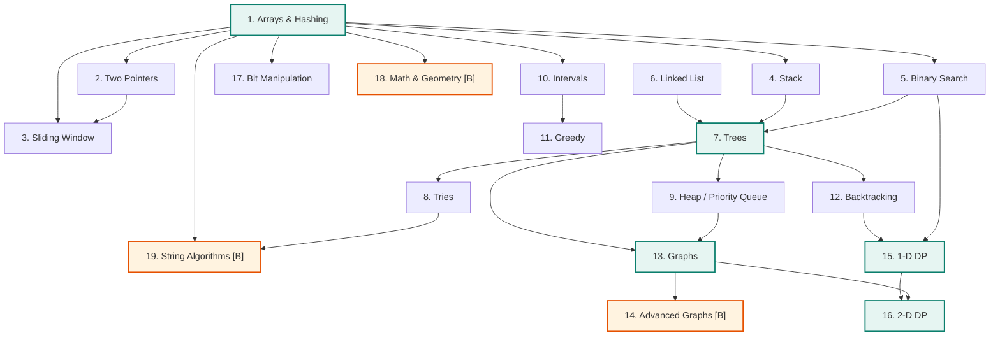

# Algora DSA Curriculum — Pattern-Based Problem Roadmap **v3.0**

> **Status:** Supersedes v2.0 (240-day topic-per-day lecture syllabus, scored 94.5/100).
> **This version shifts from theory-first to question-first:** every topic is taught through
> curated problems, not lecture videos. The pattern-dependency roadmap replaces the daily schedule.
> **Change model:** the pedagogical framework (SRS, Cold Opens, Assessment, Readiness Score) is
> unchanged. Only the _delivery format_ changes: from "Day X: Topic" to "Pattern → Problems."
>
> **Every problem appears exactly once.** When a problem uses multiple patterns (e.g., Trapping
> Rain Water uses both two pointers and stack), it is placed in the pattern where it is _first
> naturally taught_. Students recognize connections to earlier patterns — that is the point.

---

## Table of Contents

- [Part A — Primary Avatar & Promise](#part-a--primary-avatar--promise)
- [Part B — Track A / Track B Split](#part-b--track-a--track-b-split)
- [Part C — Practice Architecture](#part-c--practice-architecture)
- [Part D — Retention Engine: SRS & Cold Opens](#part-d--retention-engine-srs--cold-opens)
- [Part E — Assessment: Exams, Rubrics & Readiness Score](#part-e--assessment-exams-rubrics--readiness-score)
- [Part F — The 5-Slot DP State Template](#part-f--the-5-slot-dp-state-template)
- [Part G — Pattern-Based Problem Roadmap (227 unique problems)](#part-g--pattern-based-problem-roadmap-227-unique-problems)
- [Part H — Production Statistics](#part-h--production-statistics)
- [Part I — Pattern Distribution & ROI Audit](#part-i--pattern-distribution--roi-audit)
- [Part J — Pattern Prerequisite Graph](#part-j--pattern-prerequisite-graph)
- [Part K — Design Principles](#part-k--design-principles)
- [Part L — Production & Sustainability Plan](#part-l--production--sustainability-plan)
- [Part M — Changelog v2.0 → v3.0](#part-m--changelog-v20--v30)

---

## Part A — Primary Avatar & Promise

**Primary avatar (declared publicly, on the landing page and in Day 1):**

> A 2nd- or 3rd-year CS student, or a working developer with 0–3 years experience,
> who can write a `for` loop in one language and is targeting **product-company / FAANG-bar
> coding interviews within 8 months**.

**Explicit non-avatars:** absolute programming beginners (they need a language course first),
and active competitive programmers rated 1600+ (Track B alone will not be enough for them).

**The promise, stated as a measurable outcome:**

> By completing this roadmap you will have solved **227 curated problems** across **19 pattern
> groups**, passed **pattern-level assessments** and **mock interviews**, and be able to
> identify the right pattern for a problem you have never seen.

**What we do not promise:** that watching solutions makes you employable.
Understanding comes from struggling with the problem first. Interviews test ability.

---

## Part B — Track A / Track B Split

Every pattern group carries a track label. Students are told upfront exactly what they may skip.

| Track | Label                  | Patterns          | Rule                                                                     |
| :---- | :--------------------- | :---------------- | :----------------------------------------------------------------------- |
| **A** | Core                   | 16 pattern groups | Mandatory. Interview-load-bearing. Gates the Readiness Score.            |
| **B** | Advanced / Competitive | 3 pattern groups  | Optional. Marked `[B]`. Skipping does **not** lower the Readiness Score. |

Track B patterns: Advanced Graphs, Math & Geometry (advanced), String Algorithms.

> **Why this matters:** retention improves when students are told what they may skip.
> An undeclared audience loses the beginner at hard graph problems and bores the CP student at basic arrays.

---

## Part C — Practice Architecture

**v3.0 rule: every problem is the lesson. The solution video is the reward, not the starting point.**

For each problem, the student flow is:

```
1. READ the problem statement (2 min)
2. THINK & attempt for 15-25 min (timer visible)
3. If stuck → reveal HINT 1, then HINT 2 (progressive)
4. WATCH the solution video only AFTER attempting
5. CODE the solution yourself (no copy-paste)
6. EXPLAIN the approach out loud (interview prep)
```

**Per pattern group, problems are tiered:**

| Tier          | Purpose                                                            | Count per pattern   |
| :------------ | :----------------------------------------------------------------- | :------------------ |
| **Learn**     | First exposure. Watch the concept + walkthrough.                   | 2–4 Easy problems   |
| **Practice**  | Same pattern, harder surface. Must solve independently.            | 4–8 Medium problems |
| **Challenge** | Pattern twisted, combined, or constraint-shifted. Interview-level. | 1–3 Hard problems   |

**Volume math**

```
19 pattern groups × avg 12 problems    = 227 unique problems
Pattern assessments (5 per pattern)    =  95 assessment exposures
Mock interviews (12 × 2 problems)      =  24 problems
SRS re-exposures (from completed)      = ~400 retrieval events
------------------------------------------------------------
Total problem exposures                ≈ 746
Unique problems                        = 227
```

> **Why 227, not 500?** Quality over quantity. Every problem is hand-picked for interview
> relevance. Students who deeply understand 227 problems across all patterns will outperform
> those who grind 500 random problems without pattern recognition.

---

## Part D — Retention Engine: SRS & Cold Opens

### D.1 — The Cold Open (5 minutes, every video)

Every solution video opens with **one problem the platform selected from the student's SRS queue**,
drawn from a pattern **the student completed ≥7 days ago**. Student attempts it before the
new problem solution is shown.

### D.2 — Spaced intervals

Each mastered problem is re-served at **1, 3, 7, 21, 60 days**, then on a 120-day tail.

| Touch | Interval  | Vehicle                     |
| :---- | :-------- | :-------------------------- |
| 1     | Day 0     | The problem itself          |
| 2     | +1 day    | Quick recall quiz           |
| 3     | +3 days   | SRS queue (similar problem) |
| 4     | +7 days   | Pattern assessment          |
| 5     | +21 days  | Cold Open                   |
| 6     | +60 days  | Cross-pattern mixed exam    |
| 7     | +120 days | Mock interview              |

### D.3 — Failure routing

A missed SRS item resets that problem to interval 1 **and** injects the problem's
hint sequence + the key technique clip (30–60 s) into the student's feed.

---

## Part E — Assessment: Exams, Rubrics & Readiness Score

### E.1 — Pattern assessment (after each pattern group)

- **Timed:** 45 minutes, 5 problems.
- **Interleaved:** 3 from this pattern, 2 from any earlier pattern (SRS-selected).
- **Scored** and published against a rubric.

### E.2 — Section exam (after every 4–5 patterns)

- **Timed:** 120 minutes, 8 problems, **fully mixed across all completed patterns**.
- The section exam is an _exam_, not a recap.

### E.3 — Rubric (published, identical every assessment)

| Band          | Score  | Action                                                    |
| :------------ | :----- | :-------------------------------------------------------- |
| **Ready**     | ≥ 85%  | Proceed. Unlock next Track B pattern.                     |
| **Proceed**   | 70–84% | Proceed. SRS weights the misses up.                       |
| **Remediate** | 50–69% | Run the prescribed **remediation set** before continuing. |
| **Reset**     | < 50%  | Repeat the pattern's Practice tier. Non-negotiable gate.  |

Each problem is scored on four axes:

| Axis                                          | Weight |
| :-------------------------------------------- | :----- |
| Correctness (all tests, including edge cases) | 40%    |
| Optimal complexity achieved                   | 25%    |
| Code clarity & invariant handling             | 15%    |
| Verbal/written explanation of _why_ it works  | 20%    |

### E.4 — DSA Readiness Score

A single visible 0–100 number.

- Moves **only** on cold-retrieval performance: SRS items, timed assessments, mocks.
- **Never** moves on video completion, streaks, or time spent.
- Decays if SRS queue is neglected.

> Students should be able to say "I am at 71" and know exactly what that means.

---

## Part F — The 5-Slot DP State Template

Every DP problem (Patterns 15–16) renders the same five slots on screen, in the same place,
in the same order, without exception:

```
┌─────────────────────────────────────────────────────────────┐
│ 1. WHAT VARIES?        →  the state:      dp[i], dp[i][j]   │
│ 2. CHOICES AT A STATE  →  the transition: take / skip / ... │
│ 3. BASE CASES          →  smallest valid states             │
│ 4. ORDER OF COMPUTATION→  which index must exist first      │
│ 5. SPACE REDUCTION     →  2D → 1D → O(1) rolling            │
└─────────────────────────────────────────────────────────────┘
```

The slots are the lesson. The named problem is only the vehicle.

---

## Part G — Pattern-Based Problem Roadmap (227 unique problems)

> **Format:** Each pattern group lists problems in difficulty order (Easy → Medium → Hard).
> Every problem includes: LeetCode number, difficulty, key technique, and top company tags.
> **Every problem appears exactly once.** No duplicates across patterns.
> **YouTube mapping:** Each pattern group = 2–4 videos on the channel.
> **`[B]` = Track B, optional.**

---

### Pattern 1 — Arrays & Hashing (18 problems)

> **The foundation.** Every interview starts here. Master array traversal, index manipulation,
> and using hashmaps for O(1) lookups. This pattern alone covers ~25% of all interview questions.

**YouTube Videos:** "Arrays & Hashing Part 1: Easy Foundations" → "Part 2: HashMap Patterns" → "Part 3: Matrix & Advanced"

| #   | Problem                      | LC# | Diff   | Key Technique                               | Companies                              |
| :-- | :--------------------------- | :-- | :----- | :------------------------------------------ | :------------------------------------- |
| 1   | Contains Duplicate           | 217 | Easy   | HashSet for O(1) lookup                     | Google, Amazon, Meta                   |
| 2   | Valid Anagram                | 242 | Easy   | Frequency count array (26 chars)            | Google, Amazon, Bloomberg              |
| 3   | Two Sum                      | 1   | Easy   | HashMap: complement lookup                  | Google, Amazon, Apple, Meta            |
| 4   | Pascal's Triangle            | 118 | Easy   | Row-by-row construction                     | Google, Amazon                         |
| 5   | Majority Element             | 169 | Easy   | Boyer-Moore voting                          | Google, Amazon, Microsoft              |
| 6   | Group Anagrams               | 49  | Medium | Sorted-key hashmap grouping                 | Google, Amazon, Meta, Bloomberg        |
| 7   | Top K Frequent Elements      | 347 | Medium | Bucket sort / heap + frequency map          | Google, Amazon, Meta, Apple            |
| 8   | Product of Array Except Self | 238 | Medium | Prefix & suffix products (no division)      | Google, Amazon, Meta, Apple, Microsoft |
| 9   | Valid Sudoku                 | 36  | Medium | HashSet per row/col/box                     | Google, Amazon, Apple                  |
| 10  | Longest Consecutive Sequence | 128 | Medium | HashSet + sequence start check              | Google, Amazon, Meta, Bloomberg        |
| 11  | Sort Colors                  | 75  | Medium | Dutch National Flag (3-way partition)       | Google, Amazon, Microsoft              |
| 12  | Next Permutation             | 31  | Medium | Find rightmost ascent, swap, reverse suffix | Google, Amazon, Meta, Bloomberg        |
| 13  | Set Matrix Zeroes            | 73  | Medium | First row/col as markers                    | Google, Amazon, Meta, Microsoft        |
| 14  | Rotate Image                 | 48  | Medium | Transpose + reverse rows                    | Google, Amazon, Meta, Apple            |
| 15  | Spiral Matrix                | 54  | Medium | Layer-by-layer boundary shrink              | Google, Amazon, Meta, Microsoft        |
| 16  | Subarray Sum Equals K        | 560 | Medium | Prefix sum + hashmap of counts              | Google, Meta, Amazon, Bloomberg        |
| 17  | Encode and Decode Strings    | 271 | Medium | Length-prefix encoding                      | Google, Meta                           |
| 18  | First Missing Positive       | 41  | Hard   | Cyclic sort / index-as-hash                 | Google, Amazon, Microsoft, Bloomberg   |

---

### Pattern 2 — Two Pointers (12 problems)

> **The most versatile array technique.** Two pointers eliminate nested loops on sorted arrays.
> Opposite-direction, same-direction, and fast-slow variants. _Builds on:_ Pattern 1 (Arrays).

**YouTube Videos:** "Two Pointers: Opposite Direction" → "Two Pointers: Same Direction & Advanced"

| #   | Problem                             | LC# | Diff   | Key Technique                              | Companies                                  |
| :-- | :---------------------------------- | :-- | :----- | :----------------------------------------- | :----------------------------------------- |
| 1   | Valid Palindrome                    | 125 | Easy   | Opposite pointers, skip non-alphanumeric   | Google, Meta, Amazon                       |
| 2   | Move Zeroes                         | 283 | Easy   | Same-direction write pointer               | Google, Meta, Apple                        |
| 3   | Remove Duplicates from Sorted Array | 26  | Easy   | Slow pointer tracks unique position        | Google, Amazon, Microsoft                  |
| 4   | Squares of a Sorted Array           | 977 | Easy   | Opposite pointers, compare absolutes       | Google, Meta, Amazon                       |
| 5   | Merge Sorted Array                  | 88  | Easy   | Reverse fill from end with 3 pointers      | Google, Meta, Amazon, Microsoft            |
| 6   | Two Sum II – Input Array Is Sorted  | 167 | Medium | Opposite pointers on sorted array          | Google, Amazon, Bloomberg                  |
| 7   | 3Sum                                | 15  | Medium | Sort + fix one + two-pointer scan          | Google, Amazon, Meta, Apple, Microsoft     |
| 8   | Container With Most Water           | 11  | Medium | Opposite pointers, move the shorter line   | Google, Amazon, Meta, Goldman Sachs        |
| 9   | 3Sum Closest                        | 16  | Medium | Sort + fix one + two-pointer with min diff | Google, Amazon, Bloomberg                  |
| 10  | 4Sum                                | 18  | Medium | Sort + fix two + two-pointer               | Google, Amazon                             |
| 11  | Boats to Save People                | 881 | Medium | Sort + greedy opposite pointers            | Google, Amazon                             |
| 12  | Trapping Rain Water                 | 42  | Hard   | Opposite pointers with left/right max      | Google, Amazon, Meta, Apple, Goldman Sachs |

---

### Pattern 3 — Sliding Window (10 problems)

> **Fixed and variable windows.** The key insight: when you can express a subarray/substring
> constraint as "expand right, shrink left," you have a sliding window. _Builds on:_ Patterns 1–2.

**YouTube Videos:** "Fixed-Size Sliding Window" → "Variable-Size Sliding Window" → "Sliding Window + HashMap"

| #   | Problem                                        | LC#  | Diff   | Key Technique                                     | Companies                                  |
| :-- | :--------------------------------------------- | :--- | :----- | :------------------------------------------------ | :----------------------------------------- |
| 1   | Best Time to Buy and Sell Stock                | 121  | Easy   | Track running minimum, compute max profit         | Google, Amazon, Meta, Apple, Goldman Sachs |
| 2   | Maximum Average Subarray I                     | 643  | Easy   | Fixed window, rolling sum                         | Google, Amazon                             |
| 3   | Longest Substring Without Repeating Characters | 3    | Medium | Variable window + HashSet/HashMap                 | Google, Amazon, Meta, Apple, Bloomberg     |
| 4   | Longest Repeating Character Replacement        | 424  | Medium | Window length − max freq char ≤ k                 | Google, Amazon                             |
| 5   | Permutation in String                          | 567  | Medium | Fixed window + frequency match                    | Google, Amazon, Microsoft                  |
| 6   | Max Consecutive Ones III                       | 1004 | Medium | Variable window, count zeros ≤ k                  | Google, Meta                               |
| 7   | Minimum Size Subarray Sum                      | 209  | Medium | Variable window, shrink when sum ≥ target         | Google, Meta, Goldman Sachs                |
| 8   | Fruit Into Baskets                             | 904  | Medium | Variable window with at most 2 distinct (HashMap) | Google, Amazon                             |
| 9   | Minimum Window Substring                       | 76   | Hard   | Variable window + freq map, shrink to valid       | Google, Amazon, Meta, Apple, LinkedIn      |
| 10  | Sliding Window Maximum                         | 239  | Hard   | Monotonic deque (max in O(1))                     | Google, Amazon, Meta, Bloomberg            |

---

### Pattern 4 — Stack (11 problems)

> **LIFO for nested structures.** Stacks handle parentheses, monotonic sequences, and any
> problem where you need to "remember what came before and process it later." _Builds on:_ Pattern 1.

**YouTube Videos:** "Stack Basics: Parentheses & Evaluation" → "Monotonic Stack: Next Greater Element" → "Advanced Stack"

| #   | Problem                          | LC# | Diff   | Key Technique                                 | Companies                       |
| :-- | :------------------------------- | :-- | :----- | :-------------------------------------------- | :------------------------------ |
| 1   | Valid Parentheses                | 20  | Easy   | Stack push/pop matching                       | Google, Amazon, Meta, Bloomberg |
| 2   | Next Greater Element I           | 496 | Easy   | Monotonic decreasing stack + HashMap          | Google, Amazon, Bloomberg       |
| 3   | Min Stack                        | 155 | Medium | Auxiliary stack tracking minimums             | Google, Amazon, Meta, Bloomberg |
| 4   | Evaluate Reverse Polish Notation | 150 | Medium | Operand stack, pop two on operator            | Google, Amazon, Bloomberg       |
| 5   | Generate Parentheses             | 22  | Medium | Stack/recursion with open/close count         | Google, Amazon, Meta, Apple     |
| 6   | Daily Temperatures               | 739 | Medium | Monotonic decreasing stack of indices         | Google, Amazon, Meta, Bloomberg |
| 7   | Asteroid Collision               | 735 | Medium | Stack simulation with direction rules         | Google, Amazon                  |
| 8   | Online Stock Span                | 901 | Medium | Monotonic stack with cumulative span          | Google, Amazon, Bloomberg       |
| 9   | Car Fleet                        | 853 | Medium | Sort by position, stack by arrival time       | Google, Amazon                  |
| 10  | Simplify Path                    | 71  | Medium | Split by `/`, stack push/pop for `.` and `..` | Google, Meta, Amazon            |
| 11  | Largest Rectangle in Histogram   | 84  | Hard   | Monotonic increasing stack                    | Google, Amazon, Meta, Bloomberg |

---

### Pattern 5 — Binary Search (12 problems)

> **O(log n) on sorted/monotonic data.** Beyond simple search: binary search on answer,
> rotated arrays, and matrix search. The key: identify a monotonic predicate. _Builds on:_ Pattern 1.

**YouTube Videos:** "Binary Search Basics" → "Rotated Arrays" → "Binary Search on Answer"

| #   | Problem                                 | LC#  | Diff   | Key Technique                          | Companies                                  |
| :-- | :-------------------------------------- | :--- | :----- | :------------------------------------- | :----------------------------------------- |
| 1   | Binary Search                           | 704  | Easy   | Classic low/mid/high                   | Google, Amazon                             |
| 2   | Search Insert Position                  | 35   | Easy   | Lower bound variant                    | Google, Amazon, Apple                      |
| 3   | Sqrt(x)                                 | 69   | Easy   | Binary search on answer: mid\*mid ≤ x  | Google, Amazon, Apple                      |
| 4   | Search a 2D Matrix                      | 74   | Medium | Treat matrix as flattened sorted array | Google, Amazon, Meta, Microsoft            |
| 5   | Find Minimum in Rotated Sorted Array    | 153  | Medium | Compare mid with right bound           | Google, Amazon, Meta, Bloomberg            |
| 6   | Search in Rotated Sorted Array          | 33   | Medium | Identify sorted half, then narrow      | Google, Amazon, Meta, Microsoft, Bloomberg |
| 7   | Koko Eating Bananas                     | 875  | Medium | Binary search on answer: min speed     | Google, Amazon                             |
| 8   | Find Peak Element                       | 162  | Medium | Move toward the higher neighbor        | Google, Meta, Amazon, Apple                |
| 9   | Time Based Key-Value Store              | 981  | Medium | Binary search on timestamps            | Google, Amazon, Apple                      |
| 10  | Capacity To Ship Packages Within D Days | 1011 | Medium | Binary search on answer: min capacity  | Google, Amazon                             |
| 11  | Median of Two Sorted Arrays             | 4    | Hard   | Binary search on partition point       | Google, Amazon, Meta, Apple, Goldman Sachs |
| 12  | Split Array Largest Sum                 | 410  | Hard   | Binary search on answer + greedy check | Google, Amazon                             |

---

### Pattern 6 — Linked List (13 problems)

> **Pointer manipulation.** The core skill is managing `next` pointers without losing references.
> Fast-slow pointers, dummy heads, and in-place reversal. _Entry point — no prerequisites._

**YouTube Videos:** "Linked List Basics & Reversal" → "Fast-Slow Pointer (Floyd's)" → "Advanced: LRU Cache & k-Group"

| #   | Problem                          | LC# | Diff   | Key Technique                                 | Companies                              |
| :-- | :------------------------------- | :-- | :----- | :-------------------------------------------- | :------------------------------------- |
| 1   | Reverse Linked List              | 206 | Easy   | Iterative: prev/curr/next pointers            | Google, Amazon, Meta, Apple, Microsoft |
| 2   | Merge Two Sorted Lists           | 21  | Easy   | Dummy head + compare & link                   | Google, Amazon, Meta, Apple            |
| 3   | Linked List Cycle                | 141 | Easy   | Floyd's fast-slow pointer                     | Google, Amazon, Meta, Bloomberg        |
| 4   | Middle of the Linked List        | 876 | Easy   | Fast-slow (slow at middle when fast ends)     | Google, Amazon                         |
| 5   | Palindrome Linked List           | 234 | Easy   | Fast-slow to find middle, reverse second half | Google, Amazon, Meta                   |
| 6   | Remove Nth Node From End of List | 19  | Medium | Two pointers with n-gap                       | Google, Amazon, Meta, Apple            |
| 7   | Add Two Numbers                  | 2   | Medium | Digit-by-digit with carry                     | Google, Amazon, Meta, Apple, Microsoft |
| 8   | Linked List Cycle II             | 142 | Medium | Floyd's: find cycle entry point               | Google, Amazon, Meta                   |
| 9   | Reorder List                     | 143 | Medium | Find middle + reverse + merge interleave      | Google, Amazon, Meta                   |
| 10  | Copy List with Random Pointer    | 138 | Medium | HashMap clone or interleave-split             | Google, Amazon, Meta, Bloomberg        |
| 11  | Sort List                        | 148 | Medium | Merge sort on linked list (fast-slow split)   | Google, Amazon, Meta                   |
| 12  | LRU Cache                        | 146 | Medium | HashMap + Doubly Linked List                  | Google, Amazon, Meta, Apple, Microsoft |
| 13  | Reverse Nodes in k-Group         | 25  | Hard   | Reverse k nodes at a time, reconnect          | Google, Amazon, Meta, Microsoft        |

---

### Pattern 7 — Trees (22 problems)

> **The most-tested category.** DFS (pre/in/post), BFS (level-order), BST properties,
> and tree construction. Tree problems = recursion problems. _Builds on:_ Patterns 4, 5, 6.

**YouTube Videos:** "Tree Basics: DFS Traversals" → "BFS & Level Order" → "BST: Validate & Search" → "Advanced: Path Sum, Serialize, LCA"

| #   | Problem                                         | LC#  | Diff   | Key Technique                               | Companies                                  |
| :-- | :---------------------------------------------- | :--- | :----- | :------------------------------------------ | :----------------------------------------- |
| 1   | Invert Binary Tree                              | 226  | Easy   | Recursive swap left/right                   | Google, Amazon, Meta                       |
| 2   | Maximum Depth of Binary Tree                    | 104  | Easy   | DFS: 1 + max(left, right)                   | Google, Amazon, Meta, Apple                |
| 3   | Same Tree                                       | 100  | Easy   | Recursive compare both trees                | Google, Amazon, Bloomberg                  |
| 4   | Symmetric Tree                                  | 101  | Easy   | Mirror DFS (left.left vs right.right)       | Google, Amazon, Bloomberg, Microsoft       |
| 5   | Diameter of Binary Tree                         | 543  | Easy   | DFS tracking left+right depth at each node  | Google, Amazon, Meta                       |
| 6   | Balanced Binary Tree                            | 110  | Easy   | DFS: check height diff ≤ 1 at every node    | Google, Amazon, Bloomberg                  |
| 7   | Subtree of Another Tree                         | 572  | Easy   | Recursive isSameTree at each node           | Google, Amazon, Meta                       |
| 8   | Path Sum                                        | 112  | Easy   | DFS with remaining sum                      | Google, Amazon, Bloomberg                  |
| 9   | Lowest Common Ancestor of a BST                 | 235  | Medium | BST property: split point                   | Google, Amazon, Meta, Microsoft            |
| 10  | Binary Tree Level Order Traversal               | 102  | Medium | BFS with queue, level-by-level              | Google, Amazon, Meta, Bloomberg            |
| 11  | Binary Tree Right Side View                     | 199  | Medium | BFS: last node per level                    | Google, Amazon, Meta, Bloomberg            |
| 12  | Binary Tree Zigzag Level Order Traversal        | 103  | Medium | BFS with alternating direction              | Google, Amazon, Meta, Bloomberg            |
| 13  | Count Good Nodes in Binary Tree                 | 1448 | Medium | DFS with running max                        | Google, Amazon                             |
| 14  | Validate Binary Search Tree                     | 98   | Medium | DFS with min/max bounds                     | Google, Amazon, Meta, Bloomberg, Microsoft |
| 15  | Kth Smallest Element in a BST                   | 230  | Medium | In-order traversal, count to k              | Google, Amazon, Meta, Bloomberg            |
| 16  | Construct Binary Tree from Preorder and Inorder | 105  | Medium | Root from preorder, split via inorder index | Google, Amazon, Meta, Bloomberg            |
| 17  | Path Sum II                                     | 113  | Medium | DFS backtracking with path list             | Google, Amazon, Bloomberg                  |
| 18  | Lowest Common Ancestor of a Binary Tree         | 236  | Medium | DFS: return node if found left AND right    | Google, Amazon, Meta, Apple, Microsoft     |
| 19  | Flatten Binary Tree to Linked List              | 114  | Medium | Reverse postorder or Morris-style           | Google, Amazon, Meta                       |
| 20  | Binary Tree Maximum Path Sum                    | 124  | Hard   | DFS: return single-path, track global max   | Google, Amazon, Meta, Bloomberg, Microsoft |
| 21  | Serialize and Deserialize Binary Tree           | 297  | Hard   | Preorder with null markers                  | Google, Amazon, Meta, Apple, Microsoft     |
| 22  | Vertical Order Traversal of a Binary Tree       | 987  | Hard   | BFS + column tracking + sorting             | Google, Amazon, Meta, Bloomberg            |

---

### Pattern 8 — Tries (6 problems)

> **Prefix trees for string search.** Autocomplete, spell check, and word dictionaries.
> Especially useful combined with backtracking (Word Search II). _Builds on:_ Pattern 7 (Trees).

**YouTube Videos:** "Trie: Build & Search" → "Advanced Trie: Wildcards & Word Search"

| #   | Problem                                    | LC# | Diff   | Key Technique                           | Companies                       |
| :-- | :----------------------------------------- | :-- | :----- | :-------------------------------------- | :------------------------------ |
| 1   | Longest Common Prefix                      | 14  | Easy   | Trie or vertical scan                   | Google, Amazon, Apple           |
| 2   | Implement Trie (Prefix Tree)               | 208 | Medium | Node with children map + endOfWord flag | Google, Amazon, Meta, Microsoft |
| 3   | Design Add and Search Words Data Structure | 211 | Medium | Trie + DFS for wildcard `.`             | Google, Amazon, Meta            |
| 4   | Replace Words                              | 648 | Medium | Trie lookup for shortest prefix match   | Google, Amazon                  |
| 5   | Maximum XOR of Two Numbers in an Array     | 421 | Medium | Bitwise Trie (XOR trie)                 | Google, Amazon                  |
| 6   | Word Search II                             | 212 | Hard   | Trie + backtracking on grid             | Google, Amazon, Meta, Apple     |

---

### Pattern 9 — Heap / Priority Queue (10 problems)

> **Efficient min/max retrieval.** Use heaps when you need the smallest/largest element
> repeatedly, or need to maintain a sorted stream. _Builds on:_ Pattern 7 (Trees).

**YouTube Videos:** "Heap Basics: Build & Operations" → "Top-K Pattern" → "Two-Heap & Stream Median"

| #   | Problem                         | LC#  | Diff   | Key Technique                                  | Companies                              |
| :-- | :------------------------------ | :--- | :----- | :--------------------------------------------- | :------------------------------------- |
| 1   | Kth Largest Element in a Stream | 703  | Easy   | Min-heap of size k                             | Google, Amazon                         |
| 2   | Last Stone Weight               | 1046 | Easy   | Max-heap, smash two largest                    | Google, Amazon                         |
| 3   | K Closest Points to Origin      | 973  | Medium | Max-heap of size k (or quickselect)            | Google, Amazon, Meta, Apple            |
| 4   | Kth Largest Element in an Array | 215  | Medium | Heap or quickselect                            | Google, Amazon, Meta, Apple, Microsoft |
| 5   | Task Scheduler                  | 621  | Medium | Max-heap + cooldown queue                      | Google, Amazon, Meta, Bloomberg        |
| 6   | Reorganize String               | 767  | Medium | Max-heap, place most frequent first            | Google, Amazon                         |
| 7   | Design Twitter                  | 355  | Medium | HashMap + min-heap merge of feeds              | Google, Amazon                         |
| 8   | Merge K Sorted Lists            | 23   | Hard   | Min-heap of k list heads                       | Google, Amazon, Meta, Apple, Microsoft |
| 9   | Find Median from Data Stream    | 295  | Hard   | Two heaps: max-heap (left) + min-heap (right)  | Google, Amazon, Meta, Apple, Microsoft |
| 10  | IPO                             | 502  | Hard   | Two heaps: sort by capital, max-heap by profit | Google, Amazon                         |

---

### Pattern 10 — Intervals (8 problems)

> **Sort then sweep.** Interval problems almost always start with sorting by start or end time.
> Then merge, count, or insert with overlap logic. _Builds on:_ Pattern 1 (sorting concepts).

**YouTube Videos:** "Intervals: Merge, Insert & Overlap"

| #   | Problem                                    | LC# | Diff   | Key Technique                               | Companies                       |
| :-- | :----------------------------------------- | :-- | :----- | :------------------------------------------ | :------------------------------ |
| 1   | Meeting Rooms                              | 252 | Easy   | Sort by start, check any overlap            | Google, Amazon, Meta, Bloomberg |
| 2   | Merge Intervals                            | 56  | Medium | Sort by start, merge if overlap             | Google, Amazon, Meta, Bloomberg |
| 3   | Insert Interval                            | 57  | Medium | Find overlap position, merge range          | Google, Amazon, Meta, LinkedIn  |
| 4   | Non-Overlapping Intervals                  | 435 | Medium | Sort by end, greedy removal                 | Google, Amazon, Meta            |
| 5   | Meeting Rooms II                           | 253 | Medium | Min-heap or sweep line for concurrent count | Google, Amazon, Meta, Bloomberg |
| 6   | Minimum Number of Arrows to Burst Balloons | 452 | Medium | Sort by end, greedy arrow placement         | Google, Amazon                  |
| 7   | Interval List Intersections                | 986 | Medium | Two pointers on sorted interval lists       | Google, Meta, Amazon            |
| 8   | Employee Free Time                         | 759 | Hard   | Merge all intervals, find gaps              | Google, Amazon, Airbnb          |

---

### Pattern 11 — Greedy (12 problems)

> **Locally optimal = globally optimal.** The challenge is proving the greedy choice works.
> Common proof technique: exchange argument. _Builds on:_ Patterns 1, 10.

**YouTube Videos:** "Greedy Strategy: When Does It Work?" → "Jump Game & Scheduling" → "Advanced Greedy"

| #   | Problem                            | LC# | Diff   | Key Technique                                | Companies                              |
| :-- | :--------------------------------- | :-- | :----- | :------------------------------------------- | :------------------------------------- |
| 1   | Lemonade Change                    | 860 | Easy   | Greedy: make change with largest bills first | Google, Amazon                         |
| 2   | Maximum Subarray                   | 53  | Medium | Kadane's algorithm (reset or extend)         | Google, Amazon, Meta, Apple, Microsoft |
| 3   | Best Time to Buy and Sell Stock II | 122 | Medium | Collect every upward slope                   | Google, Amazon, Bloomberg              |
| 4   | Jump Game                          | 55  | Medium | Track farthest reachable index               | Google, Amazon, Meta                   |
| 5   | Jump Game II                       | 45  | Medium | BFS-style level expansion                    | Google, Amazon, Meta, Bloomberg        |
| 6   | Gas Station                        | 134 | Medium | Net gain + single-pass start detection       | Google, Amazon, Bloomberg              |
| 7   | Hand of Straights                  | 846 | Medium | TreeMap/sorted + form consecutive groups     | Google, Amazon                         |
| 8   | Partition Labels                   | 763 | Medium | Last occurrence map, extend partition end    | Google, Amazon                         |
| 9   | Valid Parenthesis String           | 678 | Medium | Track min/max open count                     | Google, Amazon                         |
| 10  | Largest Number                     | 179 | Medium | Custom comparator: a+b vs b+a                | Google, Amazon, Bloomberg              |
| 11  | Queue Reconstruction by Height     | 406 | Medium | Sort desc by height, insert by k-index       | Google, Amazon                         |
| 12  | Candy                              | 135 | Hard   | Two-pass: left-to-right + right-to-left      | Google, Amazon, Bloomberg              |

---

### Pattern 12 — Backtracking (12 problems)

> **Explore all possibilities, prune invalid paths.** The framework: choose → explore → un-choose.
> Every combination/permutation/partition problem is backtracking. _Builds on:_ Pattern 7 (Trees/recursion).

**YouTube Videos:** "Backtracking Framework: Subsets & Permutations" → "Combination Sum Family" → "Grid Backtracking: N-Queens & Sudoku"

| #   | Problem                               | LC# | Diff   | Key Technique                                | Companies                       |
| :-- | :------------------------------------ | :-- | :----- | :------------------------------------------- | :------------------------------ |
| 1   | Subsets                               | 78  | Medium | Include/exclude at each index                | Google, Amazon, Meta, Bloomberg |
| 2   | Subsets II                            | 90  | Medium | Sort + skip duplicates at same level         | Google, Amazon, Meta            |
| 3   | Combination Sum                       | 39  | Medium | Reuse same element, start from current index | Google, Amazon, Meta            |
| 4   | Combination Sum II                    | 40  | Medium | No reuse, sort + skip duplicates             | Google, Amazon, Meta, Bloomberg |
| 5   | Permutations                          | 46  | Medium | Swap or used-array                           | Google, Amazon, Meta, Apple     |
| 6   | Permutations II                       | 47  | Medium | Sort + skip same value at same position      | Google, Amazon, Meta            |
| 7   | Letter Combinations of a Phone Number | 17  | Medium | Map digits to letters, backtrack             | Google, Amazon, Meta, Apple     |
| 8   | Word Search                           | 79  | Medium | DFS on grid with visited marking             | Google, Amazon, Meta, Bloomberg |
| 9   | Palindrome Partitioning               | 131 | Medium | Partition + palindrome check at each cut     | Google, Amazon, Bloomberg       |
| 10  | Restore IP Addresses                  | 93  | Medium | Place 3 dots, validate each segment          | Google, Amazon                  |
| 11  | N-Queens                              | 51  | Hard   | Column + diagonal conflict tracking          | Google, Amazon, Meta            |
| 12  | Sudoku Solver                         | 37  | Hard   | Constraint propagation + backtrack           | Google, Amazon, Apple           |

---

### Pattern 13 — Graphs (20 problems)

> **BFS, DFS, and connected components on explicit and implicit graphs.** The key insight:
> grids ARE graphs. Every cell is a node; every adjacent cell is an edge. _Builds on:_ Patterns 7, 9.

**YouTube Videos:** "Graph Basics: BFS & DFS" → "Islands & Connected Components" → "Topological Sort" → "Union-Find"

| #   | Problem                        | LC#  | Diff   | Key Technique                                  | Companies                              |
| :-- | :----------------------------- | :--- | :----- | :--------------------------------------------- | :------------------------------------- |
| 1   | Flood Fill                     | 733  | Easy   | DFS/BFS from starting cell                     | Google, Amazon                         |
| 2   | Number of Islands              | 200  | Medium | DFS/BFS on grid, mark visited                  | Google, Amazon, Meta, Apple, Microsoft |
| 3   | Max Area of Island             | 695  | Medium | DFS/BFS counting cells                         | Google, Amazon, Meta                   |
| 4   | Clone Graph                    | 133  | Medium | BFS/DFS + HashMap for old→new mapping          | Google, Amazon, Meta, Bloomberg        |
| 5   | Surrounded Regions             | 130  | Medium | DFS from borders first, then flip rest         | Google, Amazon                         |
| 6   | Rotting Oranges                | 994  | Medium | Multi-source BFS                               | Google, Amazon, Meta, Bloomberg        |
| 7   | Pacific Atlantic Water Flow    | 417  | Medium | BFS/DFS from both oceans, intersect            | Google, Amazon                         |
| 8   | 01 Matrix                      | 542  | Medium | Multi-source BFS from all 0s                   | Google, Amazon                         |
| 9   | Course Schedule                | 207  | Medium | Cycle detection (DFS 3-color or BFS Kahn's)    | Google, Amazon, Meta, Apple, Microsoft |
| 10  | Course Schedule II             | 210  | Medium | Topological sort (return the order)            | Google, Amazon, Meta, Bloomberg        |
| 11  | Graph Valid Tree               | 261  | Medium | n-1 edges + connected (Union-Find or DFS)      | Google, Amazon, Meta                   |
| 12  | Number of Connected Components | 323  | Medium | Union-Find or DFS count components             | Google, Amazon, Meta                   |
| 13  | Redundant Connection           | 684  | Medium | Union-Find: edge that creates a cycle          | Google, Amazon                         |
| 14  | Is Graph Bipartite?            | 785  | Medium | BFS/DFS 2-coloring                             | Google, Amazon, Meta                   |
| 15  | Shortest Path in Binary Matrix | 1091 | Medium | BFS (8-directional)                            | Google, Meta, Amazon                   |
| 16  | Accounts Merge                 | 721  | Medium | Union-Find or DFS on email graph               | Google, Amazon, Meta                   |
| 17  | Evaluate Division              | 399  | Medium | Build weighted graph, BFS/DFS for path product | Google, Amazon, Bloomberg              |
| 18  | Snakes and Ladders             | 909  | Medium | BFS on board simulation                        | Google, Amazon                         |
| 19  | Word Ladder                    | 127  | Hard   | BFS on word transformation graph               | Google, Amazon, Meta                   |
| 20  | Alien Dictionary               | 269  | Hard   | Build graph from order, topological sort       | Google, Amazon, Meta, Bloomberg        |

---

### Pattern 14 — Advanced Graphs `[B]` (8 problems)

> **Shortest path algorithms, MST, and special graph structures.** Dijkstra, Bellman-Ford,
> Prim's, Kruskal's, and beyond. Track B — optional for basic interview prep. _Builds on:_ Pattern 13.

**YouTube Videos:** "Dijkstra's Algorithm" → "Bellman-Ford & MST" → "Tarjan's & Bridges"

| #   | Problem                                        | LC#  | Diff   | Key Technique                       | Companies            |
| :-- | :--------------------------------------------- | :--- | :----- | :---------------------------------- | :------------------- |
| 1   | Network Delay Time                             | 743  | Medium | Dijkstra's (min-heap + relaxation)  | Google, Amazon       |
| 2   | Path with Maximum Probability                  | 1514 | Medium | Modified Dijkstra (max probability) | Google               |
| 3   | Min Cost to Connect All Points                 | 1584 | Medium | Prim's or Kruskal's MST             | Google, Amazon       |
| 4   | Cheapest Flights Within K Stops                | 787  | Medium | Bellman-Ford with k+1 iterations    | Google, Amazon, Meta |
| 5   | Number of Operations to Make Network Connected | 1319 | Medium | Union-Find: count components − 1    | Google, Amazon       |
| 6   | Reconstruct Itinerary                          | 332  | Hard   | Euler path (Hierholzer's algorithm) | Google, Amazon       |
| 7   | Swim in Rising Water                           | 778  | Hard   | Binary search + BFS or Dijkstra     | Google, Amazon       |
| 8   | Critical Connections in a Network              | 1192 | Hard   | Tarjan's bridge-finding             | Google, Amazon       |

---

### Pattern 15 — 1-D Dynamic Programming (15 problems)

> **The bridge from recursion to optimization.** Start with brute-force recursion, identify
> overlapping subproblems, add memoization, convert to tabulation, reduce space.
> Use the 5-Slot Template (Part F) for every single problem. _Builds on:_ Patterns 5, 12.

**YouTube Videos:** "DP Intro: Climbing Stairs & Fibonacci" → "House Robber & Decode Ways" → "Coin Change & Word Break" → "LIS & Palindromes"

| #   | Problem                                  | LC# | Diff   | Key Technique                           | Companies                              |
| :-- | :--------------------------------------- | :-- | :----- | :-------------------------------------- | :------------------------------------- |
| 1   | Fibonacci Number                         | 509 | Easy   | dp[i] = dp[i-1] + dp[i-2]               | Google, Amazon                         |
| 2   | Climbing Stairs                          | 70  | Easy   | Same as Fibonacci                       | Google, Amazon, Apple, Bloomberg       |
| 3   | Min Cost Climbing Stairs                 | 746 | Easy   | dp[i] = cost[i] + min(dp[i-1], dp[i-2]) | Google, Amazon                         |
| 4   | House Robber                             | 198 | Medium | dp[i] = max(dp[i-1], dp[i-2] + nums[i]) | Google, Amazon, Meta, Bloomberg        |
| 5   | House Robber II                          | 213 | Medium | Circular: max(rob[0..n-2], rob[1..n-1]) | Google, Amazon                         |
| 6   | Decode Ways                              | 91  | Medium | 1-digit + 2-digit branch                | Google, Amazon, Meta, Bloomberg        |
| 7   | Coin Change                              | 322 | Medium | dp[amount] = min over coins             | Google, Amazon, Meta, Apple            |
| 8   | Maximum Product Subarray                 | 152 | Medium | Track both max and min at each position | Google, Amazon, Bloomberg              |
| 9   | Word Break                               | 139 | Medium | dp[i] = any dp[j] && word[j..i] in dict | Google, Amazon, Meta, Apple, Bloomberg |
| 10  | Longest Increasing Subsequence           | 300 | Medium | O(n²) DP or O(n log n) patience sort    | Google, Amazon, Meta, Apple            |
| 11  | Partition Equal Subset Sum               | 416 | Medium | 0/1 Knapsack: dp[sum] boolean           | Google, Amazon, Meta                   |
| 12  | Palindromic Substrings                   | 647 | Medium | Expand-around-center or DP              | Google, Amazon, Meta                   |
| 13  | Longest Palindromic Substring            | 5   | Medium | Expand-around-center                    | Google, Amazon, Meta, Apple            |
| 14  | Perfect Squares                          | 279 | Medium | dp[n] = min(dp[n - j²] + 1)             | Google, Amazon, Bloomberg              |
| 15  | Number of Longest Increasing Subsequence | 673 | Medium | DP: track both length and count         | Google, Amazon                         |

---

### Pattern 16 — 2-D Dynamic Programming (13 problems)

> **Two-dimensional state space.** Grid paths, two-string comparisons (LCS, Edit Distance),
> and interval DP. The 5-Slot Template is even more critical here. _Builds on:_ Patterns 13, 15.

**YouTube Videos:** "Grid DP: Unique Paths" → "Two-String DP: LCS & Edit Distance" → "Knapsack Variants" → "Advanced 2D DP"

| #   | Problem                                       | LC#  | Diff   | Key Technique                                      | Companies                     |
| :-- | :-------------------------------------------- | :--- | :----- | :------------------------------------------------- | :---------------------------- |
| 1   | Unique Paths                                  | 62   | Medium | dp[i][j] = dp[i-1][j] + dp[i][j-1]                 | Google, Amazon, Meta          |
| 2   | Unique Paths II                               | 63   | Medium | Same + obstacle cells = 0                          | Google, Amazon, Bloomberg     |
| 3   | Minimum Path Sum                              | 64   | Medium | dp[i][j] = grid[i][j] + min(up, left)              | Google, Amazon, Goldman Sachs |
| 4   | Longest Common Subsequence                    | 1143 | Medium | dp[i][j]: match → 1 + diagonal, else max(up, left) | Google, Amazon, Meta          |
| 5   | Edit Distance                                 | 72   | Medium | Insert/delete/replace → min of three               | Google, Amazon, Meta, Apple   |
| 6   | Coin Change 2                                 | 518  | Medium | Unbounded knapsack: count combinations             | Google, Amazon                |
| 7   | Target Sum                                    | 494  | Medium | 0/1 knapsack: count subsets with sum S             | Google, Amazon, Meta          |
| 8   | Best Time to Buy and Sell Stock with Cooldown | 309  | Medium | State machine: buy/sell/cooldown                   | Google, Amazon                |
| 9   | Interleaving String                           | 97   | Medium | dp[i][j]: s3[i+j-1] matches s1[i] or s2[j]         | Google, Amazon                |
| 10  | Maximal Square                                | 221  | Medium | dp[i][j] = min(left, up, diag) + 1                 | Google, Amazon, Apple         |
| 11  | Longest Increasing Path in a Matrix           | 329  | Hard   | DFS + memoization on grid                          | Google, Amazon, Meta          |
| 12  | Burst Balloons                                | 312  | Hard   | Interval DP: choose last balloon to burst          | Google, Amazon                |
| 13  | Regular Expression Matching                   | 10   | Hard   | dp[i][j]: match s[0..i] with p[0..j]               | Google, Amazon, Meta          |

---

### Pattern 17 — Bit Manipulation (8 problems)

> **The integer as a set of booleans.** AND, OR, XOR, shifts. The single-number family,
> power-of-two checks, and bitmask subset enumeration. _Builds on:_ Pattern 1.

**YouTube Videos:** "Bit Basics: AND, OR, XOR, Shifts" → "XOR Tricks & Counting Bits"

| #   | Problem                      | LC# | Diff   | Key Technique                              | Companies             |
| :-- | :--------------------------- | :-- | :----- | :----------------------------------------- | :-------------------- |
| 1   | Single Number                | 136 | Easy   | XOR all elements (a ⊕ a = 0)               | Google, Amazon, Meta  |
| 2   | Number of 1 Bits             | 191 | Easy   | n & (n-1) clears lowest set bit            | Google, Amazon, Apple |
| 3   | Counting Bits                | 338 | Easy   | dp[i] = dp[i >> 1] + (i & 1)               | Google, Amazon        |
| 4   | Reverse Bits                 | 190 | Easy   | Shift and build result bit by bit          | Google, Amazon, Apple |
| 5   | Missing Number               | 268 | Easy   | XOR with indices or sum formula            | Google, Amazon, Meta  |
| 6   | Sum of Two Integers          | 371 | Medium | XOR for sum, AND+shift for carry           | Google, Amazon, Meta  |
| 7   | Single Number II             | 137 | Medium | Count bits mod 3 or bit manipulation state | Google, Amazon        |
| 8   | Bitwise AND of Numbers Range | 201 | Medium | Common prefix of m and n                   | Google, Amazon        |

---

### Pattern 18 — Math & Geometry `[B]` (9 problems)

> **Number theory, modular arithmetic, and geometric reasoning.** GCD, primes, exponentiation,
> and coordinate geometry. _Builds on:_ Pattern 1.

**YouTube Videos:** "Math for Interviews: GCD, Primes, Modular" → "Geometry & Number Problems"

| #   | Problem                 | LC#  | Diff   | Key Technique                                     | Companies                       |
| :-- | :---------------------- | :--- | :----- | :------------------------------------------------ | :------------------------------ |
| 1   | Happy Number            | 202  | Easy   | Floyd's cycle detection on digit-sum sequence     | Google, Amazon                  |
| 2   | Plus One                | 66   | Easy   | Reverse carry propagation                         | Google, Amazon, Bloomberg       |
| 3   | GCD of Strings          | 1071 | Easy   | Euclidean algorithm on string lengths             | Google, Amazon                  |
| 4   | Pow(x, n)               | 50   | Medium | Binary exponentiation: O(log n)                   | Google, Amazon, Meta, Bloomberg |
| 5   | Multiply Strings        | 43   | Medium | Grade-school multiplication digit by digit        | Google, Amazon, Meta            |
| 6   | Detect Squares          | 2013 | Medium | HashMap: count points, check diagonals            | Google                          |
| 7   | Robot Bounded In Circle | 1041 | Medium | Simulate and check direction after one cycle      | Google, Amazon                  |
| 8   | Count Primes            | 204  | Medium | Sieve of Eratosthenes                             | Google, Amazon, Microsoft       |
| 9   | Reverse Integer         | 7    | Medium | Pop digits with %, push with \*10, check overflow | Google, Amazon, Bloomberg       |

---

### Pattern 19 — String Algorithms `[B]` (8 problems)

> **Beyond basic string manipulation.** KMP, Rabin-Karp, and advanced string processing.
> Basic string problems (anagrams, palindromes) are already covered in earlier patterns. _Builds on:_ Patterns 1, 8.

**YouTube Videos:** "String Manipulation Techniques" → "KMP & Pattern Matching"

| #   | Problem                                         | LC#  | Diff   | Key Technique                                        | Companies                 |
| :-- | :---------------------------------------------- | :--- | :----- | :--------------------------------------------------- | :------------------------ |
| 1   | Valid Palindrome II                             | 680  | Easy   | Two pointers + one skip allowed                      | Google, Meta, Amazon      |
| 2   | Reverse Words in a String                       | 151  | Medium | Split, reverse, rejoin (or in-place)                 | Google, Amazon, Bloomberg |
| 3   | String to Integer (atoi)                        | 8    | Medium | State machine: whitespace → sign → digits → overflow | Google, Amazon, Meta      |
| 4   | Find the Index of the First Occurrence (strStr) | 28   | Medium | KMP or Rabin-Karp                                    | Google, Amazon, Meta      |
| 5   | Repeated DNA Sequences                          | 187  | Medium | Rolling hash + HashSet                               | Google, Amazon            |
| 6   | Minimum Remove to Make Valid Parentheses        | 1249 | Medium | Stack for indices + rebuild string                   | Google, Meta, Amazon      |
| 7   | Sort Characters By Frequency                    | 451  | Medium | Frequency map + bucket sort                          | Google, Amazon, Bloomberg |
| 8   | Text Justification                              | 68   | Hard   | Greedy packing + space distribution                  | Google, Amazon, Airbnb    |

---

## Part H — Production Statistics

| Metric                      | v2.0                         | **v3.0**                            |
| :-------------------------- | :--------------------------- | :---------------------------------- |
| Total unique problems       | ~1,300 (incl. platform-only) | **227 curated** (zero duplicates)   |
| Pattern groups              | 240 daily topics             | **19 pattern groups**               |
| Track A (core) patterns     | ~196 days                    | **16 patterns**                     |
| Track B (optional) patterns | ~44 days                     | **3 patterns**                      |
| Problems: Easy              | —                            | **~62 (27%)**                       |
| Problems: Medium            | —                            | **~138 (61%)**                      |
| Problems: Hard              | —                            | **~27 (12%)**                       |
| YouTube videos (estimated)  | 240                          | **~45–55 videos** (2–3 per pattern) |
| Pattern assessments         | 32 weekly exams              | **19 pattern assessments**          |
| Section exams               | 8 month exams                | **4 section exams**                 |
| Mock interviews             | 12                           | **12**                              |

---

## Part I — Pattern Distribution & ROI Audit

### I.1 — Problem distribution by pattern

```
Trees                  ████████████████████ 22 problems  (9.7%)
Graphs                 ██████████████████   20 problems  (8.8%)
Arrays & Hashing       ████████████████     18 problems  (7.9%)
1-D Dynamic Programming████████████████     15 problems  (6.6%)
Linked List            ██████████████       13 problems  (5.7%)
2-D Dynamic Programming█████████████       13 problems  (5.7%)
Two Pointers           ████████████         12 problems  (5.3%)
Binary Search          ████████████         12 problems  (5.3%)
Backtracking           ████████████         12 problems  (5.3%)
Greedy                 ████████████         12 problems  (5.3%)
Stack                  ██████████           11 problems  (4.8%)
Sliding Window         ██████████           10 problems  (4.4%)
Heap / Priority Queue  ██████████           10 problems  (4.4%)
Math & Geometry        ████████              9 problems  (4.0%)
Intervals              ██████                8 problems  (3.5%)
Adv Graphs             ██████                8 problems  (3.5%)
Bit Manipulation       ██████                8 problems  (3.5%)
String Algorithms      ██████                8 problems  (3.5%)
Tries                  █████                 6 problems  (2.6%)
────────────────────────────────────────────────────────────────
Total                                      227 problems (100%)
```

### I.2 — Interview frequency alignment

| Pattern             | Interview Frequency | Problem Count       | Aligned?            |
| :------------------ | :------------------ | :------------------ | :------------------ |
| Arrays & Hashing    | ~25%                | 18 (7.9%)           | ✅ Solid foundation |
| Trees               | ~15%                | 22 (9.7%)           | ✅ Highest count    |
| Graphs              | ~12%                | 20 (8.8%)           | ✅ Strong           |
| Dynamic Programming | ~12%                | 28 combined (12.3%) | ✅ Strong           |
| Two Pointers        | ~10%                | 12 (5.3%)           | ✅ Good             |
| Sliding Window      | ~8%                 | 10 (4.4%)           | ✅ Good             |
| Binary Search       | ~6%                 | 12 (5.3%)           | ✅ Good             |
| Linked List         | ~5%                 | 13 (5.7%)           | ✅ Good             |
| Stack               | ~5%                 | 11 (4.8%)           | ✅ Good             |
| Backtracking        | ~4%                 | 12 (5.3%)           | ✅ Good             |
| Greedy              | ~4%                 | 12 (5.3%)           | ✅ Good             |
| Heap                | ~3%                 | 10 (4.4%)           | ✅ Good             |
| Bit Manipulation    | ~2%                 | 8 (3.5%)            | ✅ Proportional     |
| Advanced Graphs     | ~2%                 | 8 (3.5%)            | ✅ Track B          |
| Math & Geometry     | ~2%                 | 9 (4.0%)            | ✅ Proportional     |

---

## Part J — Pattern Prerequisite Graph



**Reading the graph:**

- **Green nodes** = Track A (core, interview-essential)
- **Orange nodes** = Track B (optional, competitive/advanced)
- **Arrows** = "must complete before starting"

**Recommended learning order:**

```
Phase 1 (Foundation):    Arrays & Hashing → Two Pointers → Sliding Window
Phase 2 (Search & Stack):Binary Search → Stack
Phase 3 (Linear DS):     Linked List → Trees → Tries → Heap
Phase 4 (Schedule):      Intervals → Greedy
Phase 5 (Explore):       Backtracking → Graphs → Advanced Graphs [B]
Phase 6 (Optimize):      1-D DP → 2-D DP
Phase 7 (Specialized):   Bit Manipulation → Math & Geometry [B] → String Algorithms [B]
```

---

## Part K — Design Principles

Principles 1–16 are from v2.0, preserved — they are the curriculum's pedagogical backbone.

1. **Every video = one concept.** Never overload with two major ideas.
2. **Visualization first, code second.** The student sees the algorithm think before they see syntax.
3. **Every concept connects backward.** State prerequisites explicitly; reuse prior structures.
4. **Every concept connects forward.** Show what this unlocks.
5. **Interleave review.** Every assessment includes problems from earlier patterns.
6. **Varied cognitive tasks.** Rotate predict, trace, implement, debug, explain, compare.
7. **No guessing allowed.** Students predict before they see the answer. Platform validates.
8. **Misconception-first.** Address the most common wrong model _before_ teaching the right one.
9. **Daily consistency beats marathon sessions.** Solve 2–3 problems per day, not 20 in a marathon.
10. **Interview readiness = transfer + explanation.** Not just passing tests.

11. **Videos create understanding; problems create ability.** Interviews test ability. The problem
    is the product; the video walkthrough is the reward.
12. **Nothing is learned until it is retrieved cold.** SRS retrieval from earlier patterns is
    mandatory. No exceptions.
13. **Teach the pattern, not the problem.** If a family has a shape (DP's 5 slots, backtracking's
    choose/explore/un-choose, monotonic invariants), the shape is the lesson.
14. **Every gate is measured and published.** No band without a rubric. No progression without a
    score. The Readiness Score moves only on cold retrieval — never on watch time.
15. **Declare what may be skipped.** Track B is labelled on every pattern. Honest optionality raises
    completion; undeclared difficulty destroys it.
16. **Prove transfer on camera.** At least once, derive an unseen problem live, wrong turns
    included. A rehearsed solution proves nothing.

**New in v3.0:**

17. **Question first, theory second.** Students read the problem, struggle with it, then watch the
    solution. The struggle is where learning happens. Theory is delivered _through_ problems.
18. **Pattern over problem.** Students should recognize "this is a sliding window problem" before
    they remember "this is LeetCode 76." Pattern recognition is the transferable skill.
19. **Real problems, real names.** Use LeetCode/GFG problem names students will encounter
    everywhere. Don't invent proprietary names for the same problems — students cross-reference.
20. **Dependency-driven progression.** The pattern graph tells students exactly what to learn next.
    No artificial 240-day schedule — learn at your own pace, following the prerequisite arrows.
21. **Zero duplicates.** Every problem appears exactly once in the roadmap. When a problem uses
    multiple patterns, it lives in the first pattern where it is naturally taught. Students
    recognize connections to earlier patterns — that recognition _is_ the learning.

---

## Part L — Production & Sustainability Plan

### L.1 — YouTube content cadence

| Rule                                         | Detail                                                                                                      |
| :------------------------------------------- | :---------------------------------------------------------------------------------------------------------- |
| **Batch one full pattern before publishing** | All videos for a pattern group finished before the first one goes live.                                     |
| **2–3 videos per pattern group**             | Large patterns (Trees: 22 problems) split into 3–4 videos. Small patterns (Tries: 6 problems) = 1–2 videos. |
| **Each video covers 3–5 problems**           | Brief pattern intro (2–3 min) → solve problems on screen → recap pattern.                                   |
| **Publish 3–4 videos per week**              | Sustainable pace. Pattern-based means no arbitrary daily pressure.                                          |
| **Problem walkthrough format is cheap**      | Screen + voice + code editor. No heavy animation needed for each problem.                                   |

### L.2 — Effort budget

| Asset class                                          | Count | Hrs each | Total        |
| :--------------------------------------------------- | :---- | :------- | :----------- |
| Pattern intro + walkthrough video                    | ~50   | 6        | 300          |
| Pattern assessment creation                          | 19    | 3        | 57           |
| Section exams                                        | 4     | 5        | 20           |
| Mock interviews                                      | 12    | 4        | 48           |
| Problem authoring (227 problems w/ tests + metadata) | —     | —        | ~230         |
| Platform problem integration                         | —     | —        | ~70          |
| **Total**                                            |       |          | **~725 hrs** |

At 35 productive hours/week that is **~21 weeks of work** — significantly more sustainable than
v2.0's ~54 weeks. The pattern-based format is inherently cheaper to produce because problem
walkthroughs require less animation than concept videos.

### L.3 — The one thing to protect

If schedule pressure hits, **cut Track B patterns before cutting problem quality or assessments.**
Track B is 3 optional pattern groups. The curated problems and the SRS engine are the entire
reason this curriculum beats a free YouTube playlist or random LeetCode grinding.

---

## Part M — Changelog v2.0 → v3.0

| #   | Change                                    | v2.0                                | v3.0                                                | Impact                                                   |
| :-- | :---------------------------------------- | :---------------------------------- | :-------------------------------------------------- | :------------------------------------------------------- |
| 1   | **Theory-first → Question-first**         | 240 daily concept videos            | 19 pattern groups, 227 curated problems             | Students learn by doing, not watching                    |
| 2   | **Daily schedule → Dependency graph**     | Day 1, Day 2, ... Day 240 (linear)  | Pattern prerequisite graph (flexible pace)          | Self-paced; no artificial daily pressure                 |
| 3   | **Topic names → Real problem names**      | "Day 18: Fixed-Size Sliding Window" | "Sliding Window: Minimum Window Substring (LC #76)" | Students recognize problems across platforms             |
| 4   | **1,300 platform problems → 227 curated** | Quantity-first (1,300 w/ SRS)       | Quality-first (227 hand-picked, zero duplicates)    | Every problem has a reason for being there               |
| 5   | **240 videos → ~50 videos**               | One video per day, 240 total        | 2–3 videos per pattern, ~50 total                   | More sustainable production; higher quality per video    |
| 6   | **Company tags added**                    | No company info                     | Every problem tagged with top companies             | Students prioritize based on target company              |
| 7   | **Pattern recognition explicit**          | Implicit in topic ordering          | Each group teaches a named, reusable pattern        | The transferable skill is the pattern, not the problem   |
| 8   | **Zero duplicate policy**                 | Same problem in multiple contexts   | Each problem appears exactly once                   | No confusion; students build on prior patterns naturally |

### What was preserved unchanged

- SRS & Cold Open retention engine (Part D)
- 4-band assessment rubric (Part E)
- DSA Readiness Score (Part E.4)
- 5-Slot DP State Template (Part F)
- Track A / Track B split (Part B)
- All 16 v2.0 design principles (Part K)

---

> **This document is the canonical reference for Algora's DSA content pipeline.**
> **Version 3.0.** Supersedes v2.0 in full.
>
> The shift from v2.0 to v3.0 is format, not philosophy: teach through problems, not lectures.
> Every pedagogical system (SRS, assessment, readiness scoring) is preserved.
> The question is now the lesson. Every problem appears exactly once.
